# oh-my-qoder

> 基于 superpowers、gstack、
compound 定制开发，打造团队围绕 Spec Doc 的产研协同工作流。

---

## 目录

1. [安装](#安装)
2. [整体协作流程](#整体协作流程)
3. [第一步：项目初始化](#第一步项目初始化)
4. [完整使用步骤](#完整使用步骤)
5. [命令速查卡](#命令速查卡)

---

## 安装

在 Qoder 中执行以下命令，安装全部 spec-kit 技能：

```bash
# 下载全套技能，目前beta阶段建议安装到项目级目录
npx skills add http://172.16.100.5/root/spec-kit.git --skill using-spec -a qoder
# 单个不同角色技能安装
npx skills add http://172.16.100.5/root/spec-kit.git --skill document-init -a qoder
npx skills add http://172.16.100.5/root/spec-kit.git --skill document-pm -a qoder
npx skills add http://172.16.100.5/root/spec-kit.git --skill document-dev -a qoder
npx skills add http://172.16.100.5/root/spec-kit.git --skill document-test -a qoder
npx skills add http://172.16.100.5/root/spec-kit.git --skill document-compound -a qoder
```
安装后，Qoder 会自动扫描 `.qoder/skills/` 目录，所有技能通过 `/技能名` 直接调用（如 `/document-pm`、`/qa`）。`/using-spec` 是技能发现与自动调度入口，确保根据用户意图匹配对应技能。

---
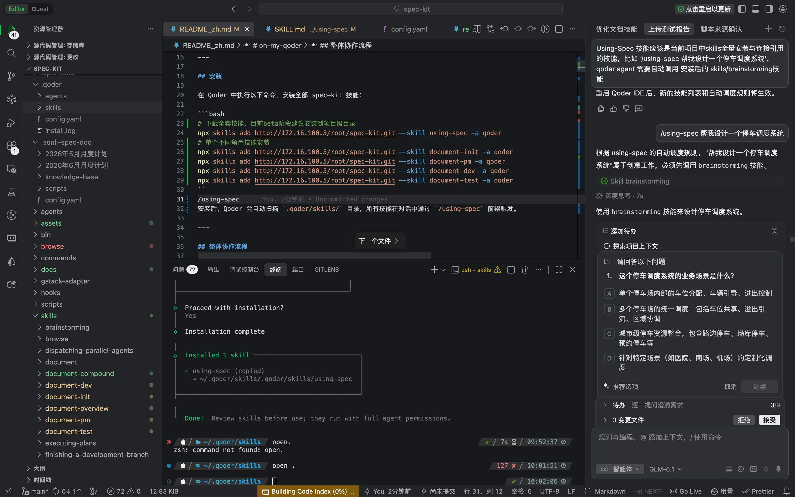

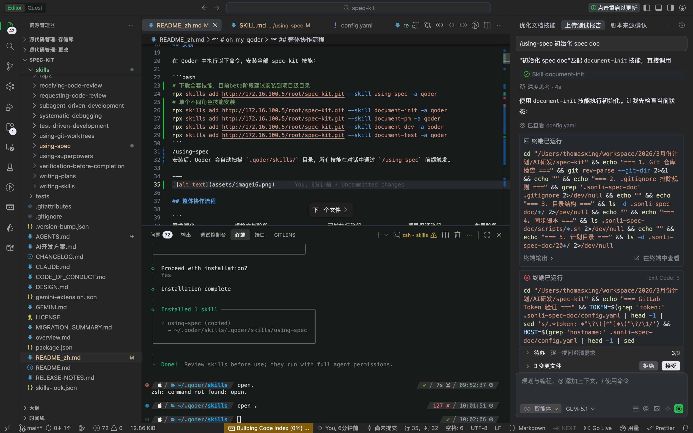

## 整体协作流程

```
需求孵化            规格文档阶段                  研发执行阶段              质量保证阶段          收尾阶段
──────────    ────────────────────────    ──────────────────────    ─────────────────    ─────────────
/brainstorm → /document-pm 生成          → /writing-plans           → /qa                → /document-compound
     ↓              ↓                           ↓                     ↓                     生成 & 上传
  设计文档      PRD 提交到仓库           → /subagent-driven-development   自动化 QA 测试
                    ↓                           ↓
              /document-dev 生成          /requesting-code-review
                    ↓                           ↓
              /document-test 生成         /finish-branch
                    ↓
              /document-overview 生成（全程持续更新）

                                                              接口文档阶段
                                                    ─────────────────────
                                                    /rap2（独立使用，任意阶段均可调用）
                                                    查询接口、生成前端代码、Mock 数据
```

技能间依赖关系：

```
document-init
    └── document-pm
            └── document-dev
                    └── document-test
                            └── document-overview
                                        └── document-compound

独立技能（无强依赖，按需调用）：
    qa        ← 开发完成后触发，覆盖浏览器自动化 + 回归测试
    rap2      ← 接口定义稳定后调用，生成前端代码 / Mock 数据
```

---

## 第一步：项目初始化

**由基础设施 Owner 执行，每个项目只做一次。**  
初始化后所有成员共享同一仓库配置，无需重复配置。

```bash
# 初始化 .sonli-spec-doc/ 目录结构，同时指定当前月度计划
# 获取个人令牌：http://172.16.100.5/profile/personal_access_tokens， 把api、read勾上
/document-init plan '2026年5月月度计划', doc git 'http://172.16.100.5/root/spec-doc.git', token 'H2pRZvWEZpqWTLtLdXu7'

# 切换到新月度计划（所有子技能路径自动更新）
/document-init plan '2026年6月月度计划'

# 查看当前活跃计划
/document-init plan current

# 列出所有已注册的计划
/document-init plan list

# 仅创建新计划目录（不切换当前活跃计划）
/document-init plan add '2026年7月月度计划'
```
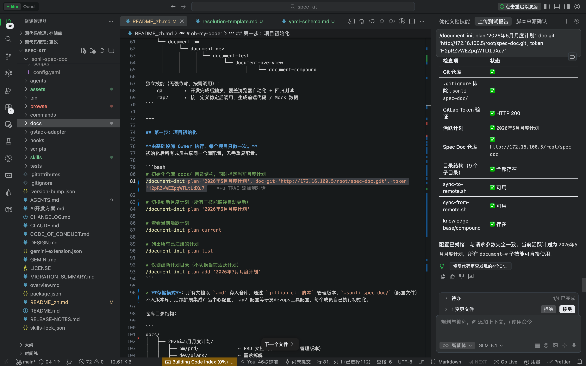
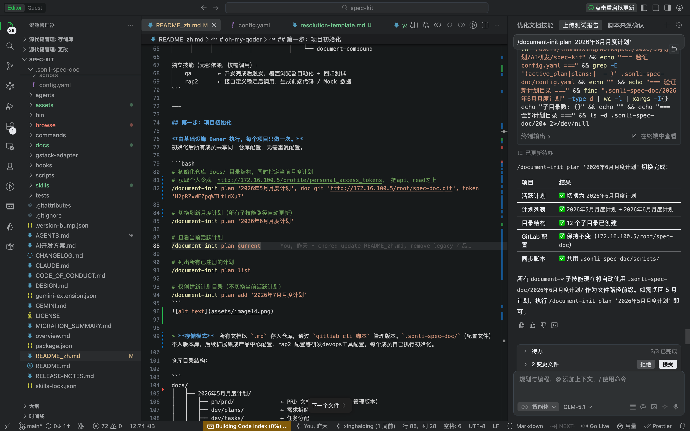


> **存储模式**：所有文档以 `.md` 存入独立的 GitLab Spec Doc 远程仓库，通过 `GitLab Commits API 脚本`（sync-to-remote.sh / sync-from-remote.sh）管理版本。`.sonli-spec-doc/`（本地工作区 + 配置文件）被 `.gitignore` 排除不入主项目仓库，后续扩展集成产品中心配置、rap2 配置等研发devops工具配置，每个成员自己执行初始化。

仓库目录结构：

```
.sonli-spec-doc/                    ← 本地工作区（.gitignore 排除，不入主项目仓库）
├── config.yaml                     ← 全局配置（GitLab 远程仓库 + Token + active_plan）
├── scripts/
│   ├── sync-to-remote.sh           ← 推送文档至 Spec Doc 远程仓库
│   └── sync-from-remote.sh         ← 从 Spec Doc 远程仓库拉取最新文档
├── 2026年5月月度计划/              ← 已注册计划
│   ├── pm/prd/                     ← PRD 文档
│   ├── dev/plans/                  ← 需求拆解
│   ├── dev/tasks/                  ← 任务分配
│   ├── dev/api/                    ← 接口文档
│   ├── dev/review-report/          ← 代码审查报告
│   ├── dev/test-report/            ← 开发测试报告
│   ├── test/testcases/             ← 测试用例
│   ├── test/test-report/           ← 测试报告
│   └── overview.md                 ← 项目进度概览
├── 2026年6月月度计划/              ← ★ 当前活跃计划（切换后自动使用此目录）
└── knowledge-base/
    └── compound/                   ← 跨迭代经验沉淀
```

---


## 完整协同使用步骤

### 阶段 1：PRD 生成（PM）

```bash
# 基于需求澄清结果生成正式 PRD，优先驱动 /brainstorming 问题澄清技能，至于prd格式产品可自行优化
/document-pm 设计一个 "停车场智能调度功能"

# PRD 质量自检（完整性评分）
# /document-pm 评估

# 提交到 Spec Doc 远程仓库
/document-pm 提交法定节假日禁止用券prd --paths docs/法定节假日禁止用券.md
```
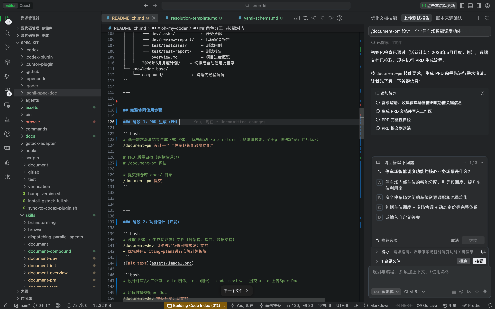

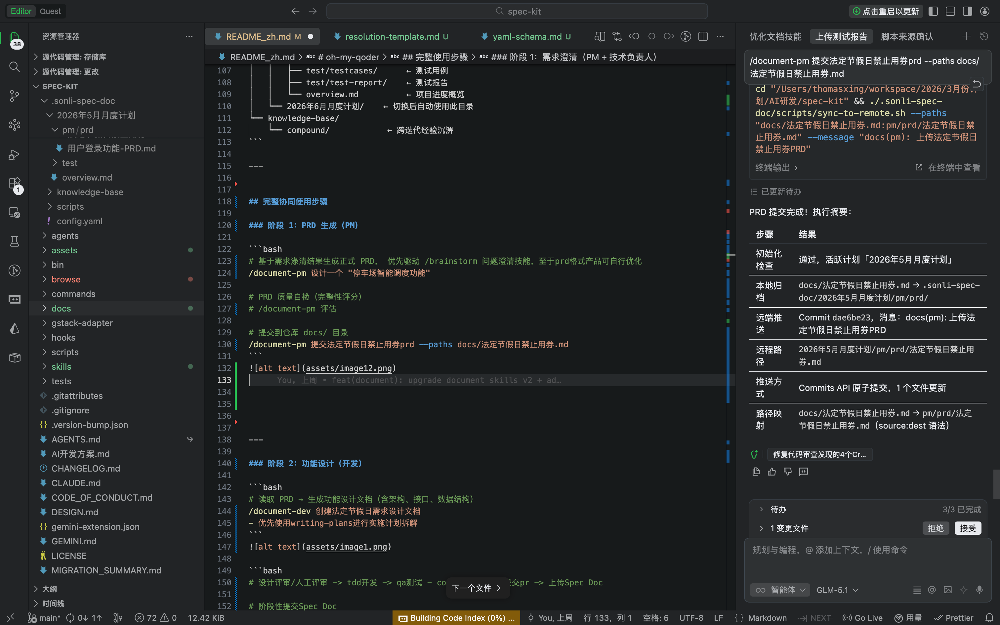


---

### 阶段 2：功能设计（开发）

```bash
# 读取 PRD → 生成功能设计文档（含架构、接口、数据结构）
/document-dev 创建法定节假日需求设计文档 
- 优先使用writing-plans进行实施计划拆解
```
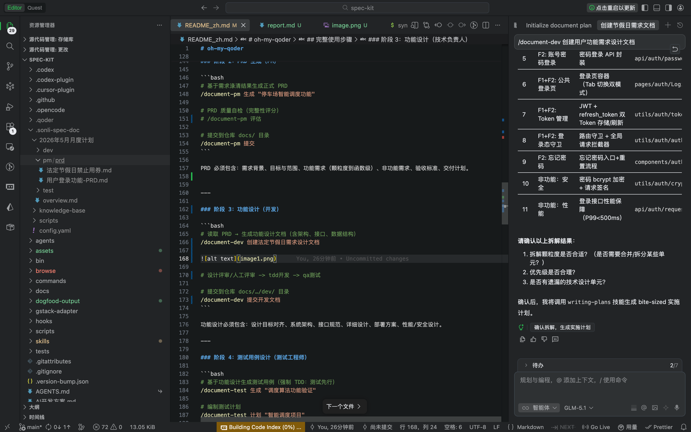

```bash
# 设计评审/人工评审 -> tdd开发 -> qa测试 - code-review - 提交pr -> 上传Spec Doc

# 阶段性提交Spec Doc
/document-dev 提交开发计划文档
```
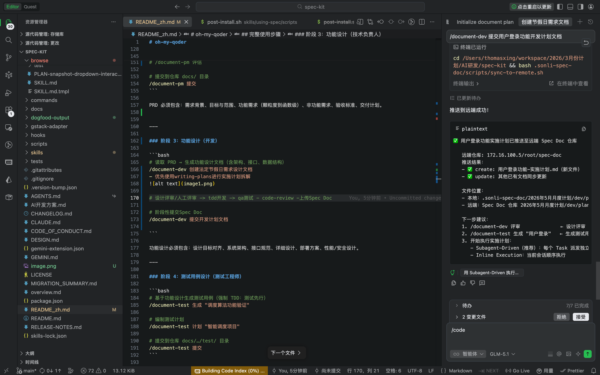
```bash

# 提交API接口文档
/document-dev 提交接口文档  --paths api/法定节假日禁止用券-接口文档.md
```
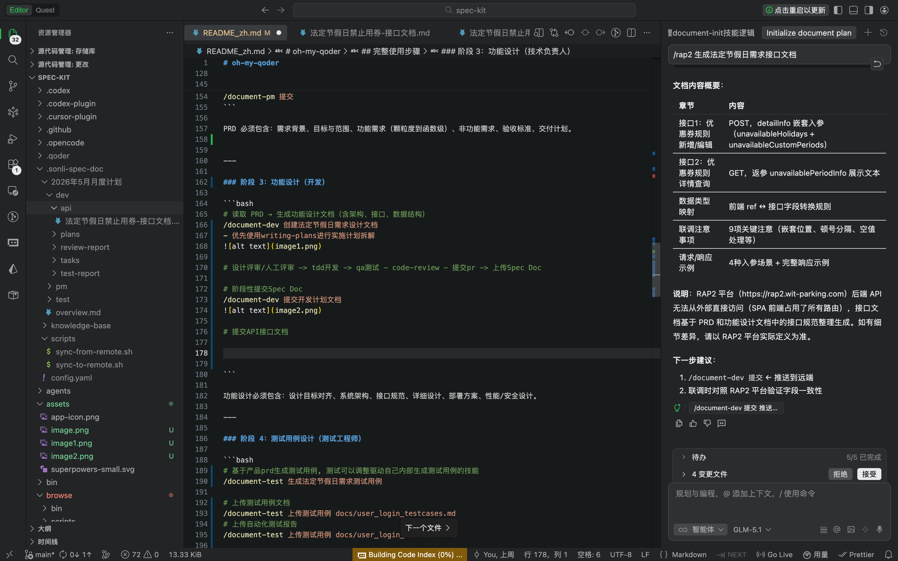


```bash
# 提交测试报告文档
/document-dev 提交法定节假日需求测试报告 --paths dogfood-output
```
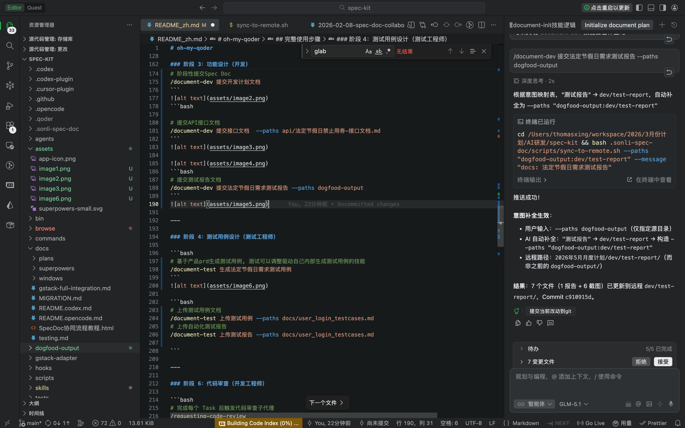

---

### 阶段 3：代码审查（开发|代码评审员）

```bash
# 完成每个 Task 后触发代码审查子代理
/requesting-code-review

# 收到审查意见后理性评估（禁止盲目同意，需技术验证）
/receiving-code-review

```

---

### 阶段 4：测试用例设计（测试工程师）

```bash
# 基于产品prd生成测试用例, 测试可以调整驱动自己内部生成测试用例的技能
/document-test 生成法定节假日需求测试用例
```
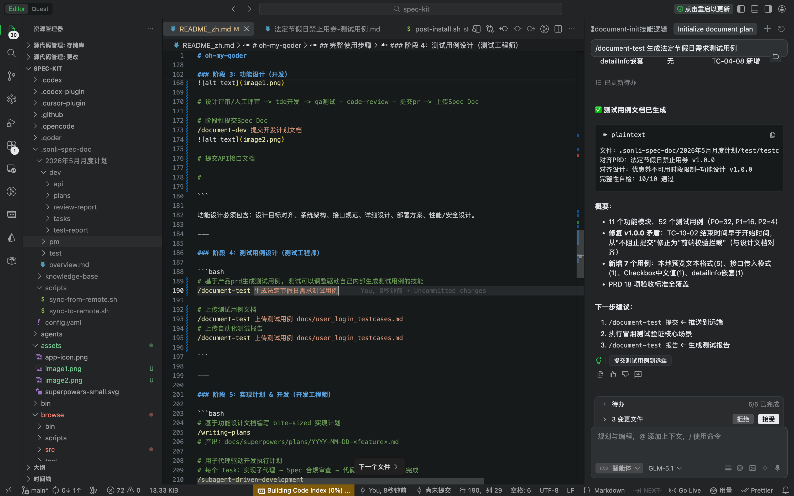

```bash
# 上传测试用例文档
/document-test 上传法定节假日测试用例
# 上传自动化测试报告
/document-test 上传测试报告 --paths docs/法定节假日禁止用券-测试报告.md

```
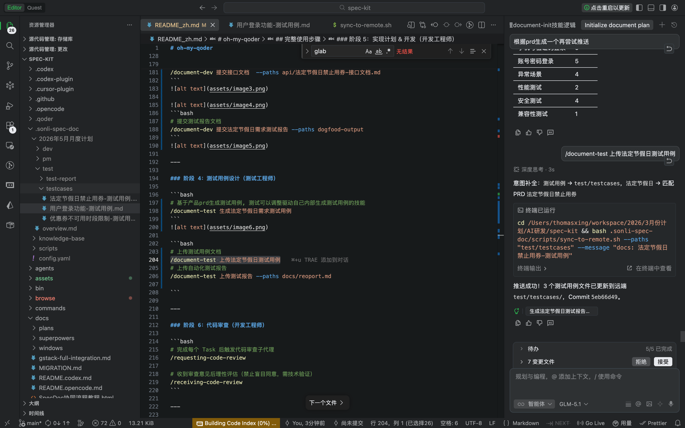

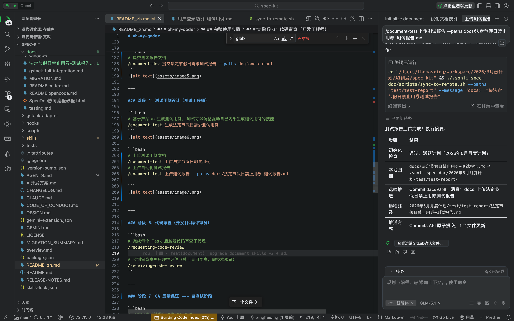


---

### 阶段 5：进度透明化（项目经理，全程持续） --- 自测试阶段

```bash
# 每日生成/更新进度报告/钉钉播报（日报 / 晨会简报）
/document-overview 播报今天的日报
/document-overview 更新日报
/document-overview 播报 简洁
/document-overview 播报 详细

# 项目健康度评估（多维度：进度/质量/风险/团队）
/document-overview 健康度
```
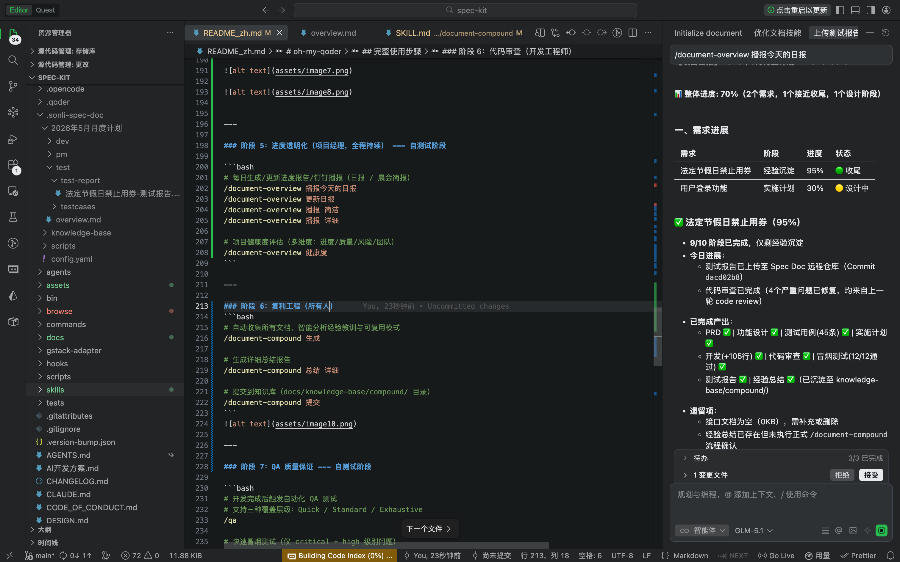

---

### 阶段 6：复利工程（所有人）
```bash
# 自动收集所有文档，智能分析经验教训与可复用模式
/document-compound 生成

# 生成详细总结报告
/document-compound 总结 详细

# 提交到知识库（.sonli-spec-doc/knowledge-base/compound/ 目录）
/document-compound 提交
```
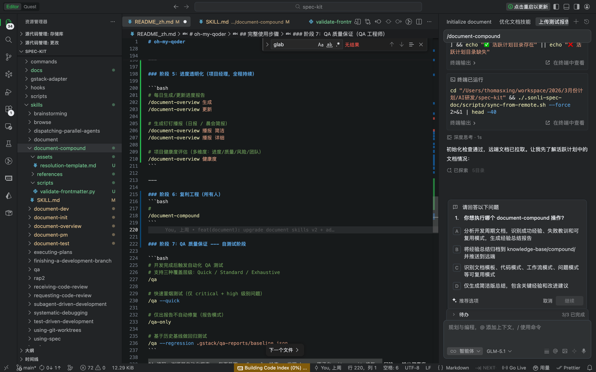

---

### 阶段 7：QA 质量保证 --- 自测试阶段

```bash
# 开发完成后触发自动化 QA 测试
# 支持三种覆盖层级：Quick / Standard / Exhaustive
/qa

# 快速冒烟测试（仅 critical + high 级别问题）
/qa --quick

# 仅出报告不自动修复（报告模式）
/qa-only

# 基于历史基线做回归测试
/qa --regression .gstack/qa-reports/baseline.json
```

QA 流程：浏览器自动化探索 → 每页截图 + Console 检查 → 发现 bug → 原子化 git commit 修复 → 回验 → 输出健康度报告。

**关键特性**：
- **Diff-aware 模式**：自动分析分支变更，仅测试受影响的页面
- **三层覆盖**：Quick（关键+高优）、Standard（+中优）、Exhaustive（+低优/样式）
- **自愈修复**：发现 bug 后自动定位源码 → 最小化修复 → atomic commit → re-test 验证
- **健康度评分**：Console / 链接 / 视觉 / 功能 / UX / 性能 / 可访问性 7 维度量化
- **跨会话学习**：QA 过程中发现的模式和陷阱沉淀到 `.gstack/learnings`

---

### 阶段 8：RAP2 接口文档管理（接口文档管理员，任意阶段按需调用）

```bash
# 查询接口文档（仓库 → 模块 → 接口 → 属性）
/rap2 查询接口

# 生成 axios 前端调用代码
/rap2 生成axios联调代码

# 生成微信小程序调用代码
/rap2 生成小程序联调代码

# 生成 Flutter 调用代码
/rap2 生成Flutter联调代码

# Java Bean 转 RAP2 JSON（批量导入用）
/rap2 转换 Java Bean

# 获取接口 Mock 数据
/rap2 Mock 数据
```

RAP2 技能独立于文档工作流，可在任意阶段使用。核心能力：
- **接口查询**：组织 → 仓库 → 模块 → 接口 → 属性，五级穿透查询
- **代码生成**：支持 axios、微信小程序、Flutter 三种前端框架
- **数据转换**：Java Bean / DTO 类自动转为 RAP2 可导入 JSON 格式
- **Mock 服务**：根据接口定义直接获取 Mock 数据，前端可脱离后端开发


## 命令速查卡

```
────────────────────────────────────────────────────────
初始化           /document-init '<月度计划名>'
切换月度计划     /document-init plan '<新计划名>'
查看活跃计划     /document-init plan current
列出所有计划     /document-init plan list
新增计划目录     /document-init plan add '<计划名>'
────────────────────────────────────────────────────────
需求澄清         /brainstorming
生成 PRD         /document-pm 生成 "<需求描述>"
评估 PRD         /document-pm 评估
提交 PRD         /document-pm 提交
────────────────────────────────────────────────────────
生成功能设计     /document-dev 生成 "<功能描述>"
设计评审         /document-dev 评审
提交设计文档     /document-dev 提交
────────────────────────────────────────────────────────
生成测试用例     /document-test 生成 "<测试场景>"
编制测试计划     /document-test 计划 "<项目名>"
提交测试文档     /document-test 提交
────────────────────────────────────────────────────────
生成进度报告     /document-overview 生成
更新进度报告     /document-overview 更新
钉钉播报         /document-overview 播报 简洁
项目健康度       /document-overview 健康度
────────────────────────────────────────────────────────
编写实现计划     /writing-plans
执行实现计划     /subagent-driven-development
请求代码审查     /requesting-code-review
接收代码审查     /receiving-code-review
────────────────────────────────────────────────────────
QA 自动化测试    /qa
快速冒烟测试     /qa --quick
QA 仅出报告      /qa-only
────────────────────────────────────────────────────────
RAP2 查询接口    /rap2 查询接口
生成 axios 代码  /rap2 生成前端代码 axios
生成小程序代码   /rap2 生成前端代码 小程序
Java Bean 转换   /rap2 转换 Java Bean
────────────────────────────────────────────────────────
迭代经验总结     /document-compound 生成
提交知识库       /document-compound 提交
────────────────────────────────────────────────────────
```