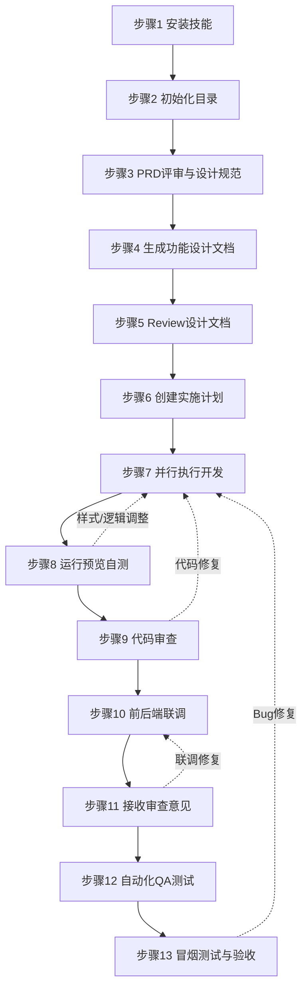

# Web 前端开发流程规范（基于 Qoder IDE）

## 文档信息

| 项 | 内容 |
|---|---|
| 举例项目 | 慧停车 Web 端管理系统 |
| 配套工具链 | Qoder IDE + Vue 3 + Vite |
| 存放位置 | `.sonli-spec-doc/knowledge-base/Web端开发流程.md` |

---

## 一、流程总览 Checklist

| 序号 | 阶段 | 步骤 | 工具/Skill | 产出物 | 完成标记 |
|:---:|:---|:---|:---|:---|:---:|
| 1 | 开发准备 | 安装前端开发相关技能 | `npx skills add` | 技能安装完成 | ⬜ |
| 2 | 开发准备 | 初始化 spec-doc 目录 | `/document-init` | `.sonli-spec-doc/` 目录 | ⬜ |
| 3 | 需求阶段 | 参与 PRD 评审与设计规范制定 | 人工协作 | DESIGN.md | ⬜ |
| 4 | 设计准备 | 依据 PRD 生成功能设计文档 | `/document-dev` | 功能设计文档 | ⬜ |
| 5 | 设计准备 | 检查功能设计文档是否符合需求 | 人工 Review | Review 批注 | ⬜ |
| 6 | 开发实施 | 创建实施计划 | `/writing-plans` | 开发计划文档 | ⬜ |
| 7 | 开发实施 | 并行执行开发任务 | `/subagent-driven-development` | 代码实现 | ⬜ |
| 8 | 开发实施 | 运行项目查看页面实现 | `npm run dev` | 本地预览 | ⬜ |
| 9 | 质量保障 | 代码审查（开发后） | `/requesting-code-review` | Code Review 报告 | ⬜ |
| 10 | 联调测试 | 前后端联调 | `/rap2` | 联调记录 | ⬜ |
| 11 | 质量保障 | 接收审查意见并修复 | `/receiving-code-review` | 修复后代码 | ⬜ |
| 12 | 测试交付 | 执行自动化 QA 测试 | `/qa` | QA 测试报告 | ⬜ |
| 13 | 测试交付 | 冒烟测试与验收 | dogfood | 冒烟测试报告 | ⬜ |

> **使用说明**：开发过程中按序号依次执行，每完成一步在"完成标记"列打勾。如某步骤发现问题需回退修改，参考下方"流程关系图"中的回退路径。

---

## 二、详细步骤说明

### 步骤 1：安装前端开发相关技能

**所属阶段**：开发准备  
**触发命令**：`npx skills add`  
**前置条件**：Qoder IDE 已安装并配置完成

**操作指引**：

1. 在 Qoder 终端中执行以下命令，安装前端开发所需技能：

```bash
# 安装全套技能
npx skills add http://172.16.100.5/root/spec-kit.git --skill using-spec -a qoder

# 安装开发相关技能
npx skills add http://172.16.100.5/root/spec-kit.git --skill document-init -a qoder
npx skills add http://172.16.100.5/root/spec-kit.git --skill document-dev -a qoder
npx skills add http://172.16.100.5/root/spec-kit.git --skill rap2 -a qoder
```

2. 确认所有技能安装成功（终端输出成功提示）

📷 **图1：技能安装及成功界面**


**验收标准**：

- [ ] 所有技能命令执行无报错
- [ ] 在 Qoder 中可正常调用 `/document-init`、`/document-dev`、`/rap2` 等命令

**预期产出**：

- 已安装的前端开发技能集

---

### 步骤 2：初始化 spec-doc 目录

**所属阶段**：开发准备  
**触发命令**：`/document-init`  
**前置条件**：步骤 1 技能安装完成

**操作指引**：

1. 在 Qoder IDE 聊天窗口输入以下命令，初始化项目文档目录：

```bash
/document-init plan '2026年5月月度计划', doc git 'http://172.16.100.5/root/spec-doc.git', token 'your-token'
```

2. 确认 `.sonli-spec-doc/` 目录结构已正确生成

📷 **图2：项目初始化及成功界面**


**验收标准**：

- [ ] `.sonli-spec-doc/` 目录已创建
- [ ] 目录结构与团队规范一致

**预期产出**：

- 初始化完成的 `.sonli-spec-doc/` 目录

---

### 步骤 3：参与 PRD 评审与设计规范制定

**所属阶段**：需求阶段  
**执行方式**：人工协作  
**前置条件**：PRD 文档已完成

**操作指引**：

1. 参与产品 PRD 需求评审，明确功能范围与优先级
2. 与设计团队协作制定项目 `DESIGN.md`，包含：
   - **色彩体系**：主色、辅色、功能色定义
   - **字体规范**：字号层级、字重使用规则
   - **组件设计规范**：按钮、表单、弹窗等通用组件样式
   - **交互规范**：加载态、空态、错误态等统一交互方案

**验收标准**：

- [ ] PRD 中所有功能点已确认，无模糊描述
- [ ] DESIGN.md 已编写并经设计团队确认

**预期产出**：

- 确认后的 PRD 评审记录
- 项目 DESIGN.md

---

### 步骤 4：依据 PRD 生成功能设计文档

**所属阶段**：设计准备  
**触发命令**：`/document-dev`  
**前置条件**：步骤 3 PRD 评审通过，DESIGN.md 已确认

**操作指引**：

1. 在 Qoder IDE 聊天窗口输入：

```bash
/document-dev 创建 <需求名> 设计文档
```

2. 选择或指定对应的 PRD 文件路径
3. AI 将基于 PRD 自动生成功能设计文档，包含：
   - 页面清单与路由规划
   - 组件拆分建议
   - 状态管理设计（Pinia）
   - 接口调用规划
4. 人工检查生成的文档是否覆盖 PRD 中所有功能点

📷 **图3：功能设计文档生成界面**


**验收标准**：

- [ ] 所有 PRD 中提到的页面均已列出
- [ ] 各页面的核心功能逻辑有设计说明
- [ ] 公共组件复用建议已给出
- [ ] 接口调用规划与后端文档一致

**预期产出**：

- 功能设计文档（默认输出至 `.sonli-spec-doc/<月度计划>/dev/plans/`）

---

### 步骤 5：检查功能设计文档是否符合需求

**所属阶段**：设计准备  
**执行方式**：人工 Review  
**前置条件**：步骤 4 已完成

**操作指引**：

1. 逐条对照 PRD 检查功能设计文档
2. 重点关注以下维度：
   - **页面完整性**：有无遗漏页面或隐藏页面
   - **功能一致性**：功能逻辑是否与 PRD 描述一致
   - **边界场景**：网络异常、空数据、权限不足等场景是否考虑
   - **设计规范一致性**：与 DESIGN.md 中的色彩、字体、组件规范是否对齐
3. 如有问题，在文档中直接批注或记录 Review 意见

**验收标准**：

- [ ] 页面列表与 PRD 完全一致
- [ ] 核心功能逻辑无偏差
- [ ] 边界场景已补充说明（至少覆盖：空数据、网络异常、超时）
- [ ] 设计规范引用正确

---

### 步骤 6：创建实施计划

**所属阶段**：开发实施  
**触发命令**：`/writing-plans`  
**前置条件**：步骤 5 Review 通过

**操作指引**：

1. 在 Qoder IDE 中执行 `/writing-plans`
2. 输入或选择已确认的功能设计文档
3. AI 将基于设计文档生成可执行的实施计划，通常包含：
   - 任务拆分（按页面/组件维度）
   - 预估工时
   - 任务依赖关系（如页面 A 依赖组件 B）
   - 风险点提示
4. 人工确认计划合理性，必要时调整：
   - 任务优先级排序
   - 工时校准
   - 依赖关系修正

**验收标准**：

- [ ] 所有页面/组件均有对应的开发任务
- [ ] 任务依赖关系正确（无循环依赖）
- [ ] 工时预估合理（单个任务不超过 8 人时）

**预期产出**：

- 开发实施计划文档（Markdown 格式任务清单）

---

### 步骤 7：并行执行开发任务

**所属阶段**：开发实施  
**触发命令**：`/subagent-driven-development`  
**前置条件**：步骤 6 已创建并确认实施计划

**操作指引**：

1. 在 Qoder IDE 中执行 `/subagent-driven-development`
2. 选择已创建的实施计划
3. AI 将按任务拆分自动或辅助完成代码开发：
   - 页面结构（`.vue` 文件）
   - 样式实现（`.scss` / `.css`）
   - 业务逻辑（JS / TS）
   - API 对接（`src/api/` 新增或修改）
4. 开发过程中保持人工 review，确保代码符合团队规范

**编码规范提示**：

- 遵循项目 ESLint 配置（`.eslintrc`）
- Vue 组件使用 Composition API + `<script setup>` + TypeScript
- 样式类名遵循 BEM 或项目已有命名规范
- 提交开发计划文档：`/document-dev 提交开发计划文档`

**验收标准**：

- [ ] 所有计划任务已完成编码
- [ ] 代码能通过 ESLint 检查
- [ ] 无明显的 TypeError 或语法错误

**预期产出**：

- 完整的页面/组件代码
- 新增或更新的 API 封装文件

---

### 步骤 8：运行项目查看页面实现

**所属阶段**：开发实施  
**命令**：`npm run dev`  
**前置条件**：步骤 7 代码开发完成

**操作指引**：

1. 终端执行 `npm run dev` 启动开发预览
2. 在浏览器中打开本地预览地址，对照设计稿检查视觉还原度：
   - 页面布局是否一致
   - 颜色、字体、间距是否匹配
   - 图片是否正确显示
3. 结合产品原型验证功能逻辑：
   - 表单提交与校验
   - 页面跳转与传参
   - 数据加载与展示
   - 弹窗、加载态等交互效果

**调整记录模板**：

| 问题类型 | 问题描述 | 修复位置 | 修复状态 |
|---|---|---|---|
| 样式偏差 | 按钮颜色不对 | `xxx.vue` | ⬜ |
| 逻辑问题 | 表单未校验手机号 | `xxx.vue` | ⬜ |

**验收标准**：

- [ ] 页面布局与设计稿基本一致（允许 1-2px 偏差）
- [ ] 核心功能逻辑可正常运行
- [ ] 无明显的白屏、样式错乱问题

**预期产出**：

- 与视觉稿高保真一致的页面实现
- 问题修复记录（如有）

---

### 步骤 9：代码审查（开发后）

**所属阶段**：质量保障  
**触发命令**：`/requesting-code-review`  
**前置条件**：步骤 8 自测通过

**操作指引**：

1. 在 Qoder IDE 中执行 `/requesting-code-review`
2. 选择需要审查的文件范围（建议全量审查本次开发涉及的所有文件）
3. AI 将基于团队规范进行代码审查，重点关注：
   - 代码规范（命名、格式、注释）
   - 潜在 Bug（空值、异步处理、内存泄漏）
   - 性能问题（重复渲染、大数据遍历、图片未压缩）
   - 安全漏洞（敏感信息硬编码、XSS 风险）
4. 根据 Review 结果逐条修复问题

**审查重点 Checklist**：

- [ ] 变量/函数命名语义清晰，无拼音命名
- [ ] 异步操作（`async/await`、`Promise`）有错误处理
- [ ] 无 `console.log`、`debugger` 等调试代码残留
- [ ] Vue 组件生命周期使用正确
- [ ] 无敏感信息（密钥、Token）硬编码在代码中
- [ ] 列表渲染有 `key` 绑定

**验收标准**：

- [ ] 所有 Review 问题已修复或确认无需修复
- [ ] 代码审查报告已归档

**预期产出**：

- Code Review 报告
- 修复后的代码

---

### 步骤 10：前后端联调

**所属阶段**：联调测试  
**触发命令**：`/rap2`  
**前置条件**：后端接口已部署测试环境，步骤 9 审查通过

**操作指引**：

1. 在 Qoder IDE 中执行 `/rap2`，查询项目对应的接口文档
2. 获取接口 Mock 数据（前端可脱离后端开发）：

```bash
/rap2 Mock 数据
```

3. 生成 axios 前端调用代码：

```bash
/rap2 生成axios联调代码
```

4. 逐一联调核心接口，验证：
   - 请求参数是否正确（字段名、类型、必填项）
   - 返回数据结构是否符合预期
   - 异常场景处理（404、500、超时、无网络）
5. 如接口与预期不符，及时与后端沟通并在文档中记录
6. 如遇集成问题，使用 `/investigate` 定位根因

📷 **图4：API 接口文档提交及成功界面**


**联调 Checklist**：

- [ ] 页面初始化数据加载正常
- [ ] 表单提交接口返回正确，有成功/失败提示
- [ ] 错误提示友好（用户可理解，非技术错误码）
- [ ] Loading 和错误状态有统一处理

**常见问题处理**：

| 问题现象 | 排查方向 |
|---|---|
| 接口 404 | 确认环境配置（`.env.development` 或 `.env.production`） |
| 参数错误 | 对照 RAP2 文档检查字段名和类型 |
| 返回为空 | 确认测试数据是否已准备 |
| 跨域/鉴权失败 | 检查请求头中的 token 或 cookie，确认代理配置 |

**验收标准**：

- [ ] 所有核心接口联调通过
- [ ] Mock 数据已替换为真实接口调用
- [ ] 接口报错有统一处理

**预期产出**：

- 接口联调记录
- API 封装代码
- 问题清单及沟通记录（如有）

---

### 步骤 11：接收审查意见并修复

**所属阶段**：质量保障  
**触发命令**：`/receiving-code-review`  
**前置条件**：步骤 10 联调完成

**操作指引**：

1. 在 Qoder IDE 中执行 `/receiving-code-review`
2. 理性评估审查意见（禁止盲目同意，需技术验证）
3. 重点审查联调过程中修改的代码（如接口调用、错误处理、状态管理调整）
4. 确保联调修复没有引入新的问题

**审查重点**：

- [ ] 联调期间的临时调试代码（如 mock 数据、固定参数）已清理
- [ ] 接口报错有统一处理（如 axios 拦截器）
- [ ] 边界条件处理完善（空数据、超长列表、特殊字符）
- [ ] 新增的全局修改（如 `App.vue`、`utils/`）无负面影响

**验收标准**：

- [ ] 所有联调修改已 Review 通过
- [ ] 无回归问题

**预期产出**：

- 联调后的 Code Review 报告
- 最终可交付代码

---

### 步骤 12：执行自动化 QA 测试

**所属阶段**：测试交付  
**触发命令**：`/qa`  
**前置条件**：功能开发及联调全部完成

**操作指引**：

1. 在 Qoder IDE 中执行 `/qa`，触发自动化 QA 测试
2. 可根据需要选择不同模式：

```bash
# 快速冒烟测试（仅 critical + high 级别问题）
/qa --quick

# 仅出报告不自动修复
/qa-only

# 基于历史基线做回归测试
/qa --regression .gstack/qa-reports/baseline.json
```

3. 等待 QA 流程完成，查看健康度报告

📷 **图5：自动化 QA 测试界面**


**QA 流程说明**：浏览器自动化探索 → 每页截图 + Console 检查 → 发现 bug → 原子化 git commit 修复 → 回验 → 输出健康度报告。

**关键特性**：

- **Diff-aware 模式**：自动分析分支变更，仅测试受影响的页面
- **三层覆盖**：Quick（关键+高优）、Standard（+中优）、Exhaustive（+低优/样式）
- **自愈修复**：发现 bug 后自动定位源码 → 最小化修复 → atomic commit → re-test 验证
- **健康度评分**：Console / 链接 / 视觉 / 功能 / UX / 性能 / 可访问性 7 维度量化

**验收标准**：

- [ ] 所有关键和高优先级问题已修复
- [ ] 健康度评分达到团队标准
- [ ] 测试报告已生成并归档

**预期产出**：

- QA 测试报告（含健康度评分、问题详情、修复记录）
- 提交测试报告：`/document-dev 提交测试报告 --paths dogfood-output`

📷 **图6：提交测试报告界面**


---

### 步骤 13：冒烟测试与验收

**所属阶段**：测试交付  
**前置条件**：步骤 12 QA 测试通过

**操作指引**：

1. 根据测试上传的冒烟用例完成 Web 端集成测试
2. 参与产品发布前的冒烟测试与验收
3. 每天跟进解决项目过程产生的 bug

**测试通过标准**：

- [ ] 所有 P0 级冒烟用例执行通过
- [ ] 无阻塞性 Bug（Crash、白屏、核心功能不可用）
- [ ] 测试报告已生成并归档

**验收标准**：

- [ ] 产品验收通过
- [ ] 无遗留 P0/P1 级 Bug

**预期产出**：

- 冒烟测试报告
- 验收确认记录

---

## 三、流程关系图



---

## 四、常见开发场景

### 新功能开发（New Feature）

- 新产品功能开发（从 PRD 到上线全流程）
- 使用 `/document-dev` 生成技术设计文档和实施计划
- 使用 `/subagent-driven-development` 并行执行独立任务
- 使用 `/qa` 进行自动化测试与 bug 修复
- 使用 `/requesting-code-review` 完成代码审查后提交 PR

### 紧急修复（Hot Fix）

- 线上紧急 bug 修复
- 使用 `/using-git-worktrees` 创建隔离分支环境，避免影响主开发流程
- 使用 `/investigate` 进行根因分析与问题定位
- 使用 `/systematic-debugging` 解决复杂技术问题
- 快速修复 → 本地验证 → 提交 PR → 紧急发布
- 修复后使用 `/document-compound` 沉淀问题模式与解决方案

### 重构与优化（Refactor & Optimization）

- 代码重构与性能优化
- 使用 `/health` 检查代码质量基线
- 使用 `/design-review` 优化 UI 一致性与用户体验
- 使用 `/qa` 验证重构后功能完整性
- 性能优化使用 `/benchmark` 建立性能基线与对比

### 组件开发（Component Development）

- 通用组件/组件库开发
- 使用 `/design-consultation` 建立设计规范
- 使用 `/design-html` 生成生产级 UI 实现
- 组件文档与使用示例编写
- 使用 `/qa` 进行跨浏览器兼容性测试

### 集成与调试（Integration & Debugging）

- 第三方服务集成（API 对接、SDK 接入）
- 前后端联调与接口问题排查
- 使用 `/rap2` 查询与管理接口文档
- 使用 `/qa` 进行端到端功能验证
- 使用 `/investigate` 定位集成问题根因

---

## 五、附录

### 5.1 常用命令速查

#### 项目开发命令

| 命令 | 说明 |
|---|---|
| `npm install` | 安装项目依赖 |
| `npm run dev` | 启动开发预览 |
| `npm run build` | 构建生产包 |
| `npm run lint` | 执行 ESLint 代码检查 |

#### Qoder IDE Skill 命令

| 命令 | 使用场景 | 对应本文步骤 |
|---|---|:---:|
| `/document-init` | 初始化 spec-doc 目录 | 2 |
| `/document-dev` | 依据 PRD 生成前端功能设计文档 | 4 |
| `/writing-plans` | 创建开发实施计划 | 6 |
| `/subagent-driven-development` | 执行开发计划 | 7 |
| `/requesting-code-review` | 代码审查 | 9 |
| `/receiving-code-review` | 接收审查意见 | 11 |
| `/rap2` | 查询接口文档并联调 | 10 |
| `/qa` | 自动化 QA 测试 | 12 |
| `/investigate` | 定位集成问题根因 | 10 |

#### 技能安装命令

| 命令 | 说明 |
|---|---|
| `npx skills add <repo> --skill using-spec -a qoder` | 安装全套技能 |
| `npx skills add <repo> --skill document-init -a qoder` | 安装文档初始化技能 |
| `npx skills add <repo> --skill document-dev -a qoder` | 安装开发文档技能 |
| `npx skills add <repo> --skill rap2 -a qoder` | 安装 RAP2 接口技能 |

### 5.2 相关文档索引

| 文档类型 | 路径 |
|---|---|
| 产品需求文档（PRD） | `docs/prd/` |
| 设计规范（DESIGN.md） | 项目根目录 `DESIGN.md` |
| 功能设计文档 | `.sonli-spec-doc/<月度计划>/dev/plans/` |
| 开发实施计划 | `.sonli-spec-doc/<月度计划>/dev/plans/` |
| 代码 Review 报告 | `.sonli-spec-doc/<月度计划>/dev/review-report/` |
| QA 测试报告 | `.sonli-spec-doc/<月度计划>/test/test-report/` |
| API 封装目录 | `src/api/` |
| 项目组件库 | `src/components/` |

### 5.3 常见问题速查

**Q：步骤 7 AI 生成的代码不符合项目规范怎么办？**  
A：先执行步骤 9 的代码审查，AI 会基于项目 ESLint 配置给出修改建议。如仍有风格差异，可在 Qoder IDE 中补充项目的编码规范说明。

**Q：接口联调时后端接口未就绪，如何并行开发？**  
A：可在 `src/api/` 中先定义接口函数并使用 `/rap2 Mock 数据` 生成 mock，待后端接口就绪后替换为真实调用。注意联调前清理所有 mock。

**Q：QA 测试发现 bug 如何处理？**  
A：`/qa` 支持自愈修复模式，会自动定位源码并生成最小化修复。对于复杂问题，可使用 `/investigate` 或 `/systematic-debugging` 手动排查。

**Q：如何查看项目整体进度？**  
A：执行 `/document-overview 健康度` 查看项目健康度评估。

📷 **图7：项目健康度界面**


