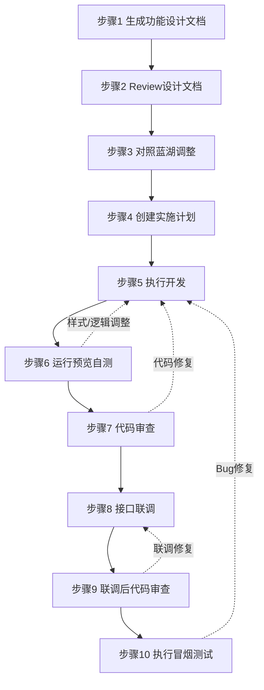

# 小程序端开发流程规范（基于 Qoder IDE）

## 文档信息

| 项 | 内容 |
|---|---|
| 举例项目 | 慧停车小程序 Taro 多端小程序 |
| 配套工具链 | Qoder IDE + Taro + 微信/支付宝开发者工具 |
| 存放位置 | `.sonli-spec-doc/knowledge-base/小程序端开发流程.md` |

---

## 一、流程总览 Checklist

| 序号 | 阶段 | 步骤 | 工具/Skill | 产出物 | 完成标记 |
|:---:|:---|:---|:---|:---|:---:|
| 1 | 设计准备 | 依据 PRD 生成前端功能设计文档 | `/document-dev` | 功能设计文档 | ⬜ |
| 2 | 设计准备 | 检查功能设计文档是否符合需求 | 人工 Review | Review 批注 | ⬜ |
| 3 | 设计准备 | 依据蓝湖设计稿调整功能设计文档 | 蓝湖平台 | 更新后的设计文档 | ⬜ |
| 4 | 开发实施 | 创建实施计划 | `/writing-plans` | 开发计划文档 | ⬜ |
| 5 | 开发实施 | 执行实施计划 | `/subagent-driven-development` | 代码实现 | ⬜ |
| 6 | 开发实施 | 运行项目查看页面实现 | `npm run dev:weapp` | 本地预览 | ⬜ |
| 7 | 质量保障 | 代码审查（开发后） | `/requesting-code-review` | Code Review 报告 | ⬜ |
| 8 | 联调测试 | 查询接口并联调 | `/rap2` | 联调记录 | ⬜ |
| 9 | 质量保障 | 代码审查（联调后） | `/requesting-code-review` | Code Review 报告 | ⬜ |
| 10 | 测试交付 | 执行自动化冒烟 UI 测试 | Minium / Appium | 冒烟测试报告 | ⬜ |

> **使用说明**：开发过程中按序号依次执行，每完成一步在"完成标记"列打勾。如某步骤发现问题需回退修改，参考下方"流程关系图"中的回退路径。

---

## 二、详细步骤说明

### 步骤 1：依据 PRD 生成前端功能设计文档

**所属阶段**：设计准备  
**触发命令**：`/document-dev`  
**前置条件**：PRD 文档已完成评审并归档至 `docs/prd/` 或 `.sonli-spec-doc/.../prd/`

**操作指引**：

1. 在 Qoder IDE 聊天窗口输入 `/document-dev`
2. 选择或指定对应的 PRD 文件路径
3. AI 将基于 PRD 自动生成前端功能设计文档，包含：
   - 页面清单与路由规划
   - 组件拆分建议
   - 状态管理设计（Vuex / Pinia）
   - 接口调用规划
4. 人工检查生成的文档是否覆盖 PRD 中所有功能点

**验收标准**：

- [ ] 所有 PRD 中提到的页面均已列出
- [ ] 各页面的核心功能逻辑有设计说明
- [ ] 涉及多端差异（微信/支付宝）的地方已明确标注
- [ ] 公共组件复用建议已给出

**预期产出**：

- 功能设计文档（默认输出至 `.sonli-spec-doc/<月度计划>/dev/plans/`）

> **注意**：如 PRD 中需求描述模糊，应先与产品经理确认后再执行本步骤。

📷 **图1：`/document-dev` 命令执行界面及生成的功能设计文档预览**


---

### 步骤 2：检查功能设计文档是否符合需求

**所属阶段**：设计准备  
**执行方式**：人工 Review  
**前置条件**：步骤 1 已完成

**操作指引**：

1. 逐条对照 PRD 检查功能设计文档
2. 重点关注以下维度：
   - **页面完整性**：有无遗漏页面或隐藏页面
   - **功能一致性**：功能逻辑是否与 PRD 描述一致
   - **边界场景**：网络异常、空数据、权限不足等场景是否考虑
   - **多端适配**：微信小程序与支付宝小程序的差异处理是否明确
3. 如有问题，在文档中直接批注或记录 Review 意见

**验收标准**：

- [ ] 页面列表与 PRD 完全一致
- [ ] 核心功能逻辑无偏差
- [ ] 边界场景已补充说明（至少覆盖：空数据、网络异常、超时）


---

### 步骤 3：依据蓝湖设计稿调整功能设计文档

**所属阶段**：设计准备  
**涉及平台**：蓝湖 / Figma  
**前置条件**：设计稿已上传蓝湖并标注，步骤 2 Review 通过

**操作指引**：

1. 打开蓝湖对应项目的设计稿
2. 对照设计稿调整功能设计文档中的以下内容：
   - **页面布局与结构**：根据设计稿更新页面模块划分
   - **图片资源**：替换为实际切图，优先使用 OSS/CDN 地址或复用已有图片资源
   - **样式规范**：颜色、字体、间距等，优先使用项目已有公共变量
3. 确认公共组件的复用性：
   - 检查 `src/components/` 是否已有类似组件
   - 评估是否需要新增通用组件

**资源规范**：

| 资源类型 | 规范 |
|---|---|
| 图片 | 优先使用 OSS/CDN 地址，避免本地大图 |
| 颜色 | 统一使用 `src/app.scss` 中定义的变量 |
| 字体 | 遵循设计规范，使用项目已有的字体大小变量 |
| 间距 | 优先复用 `src/app.scss` 中的通用间距类 |

**验收标准**：

- [ ] 所有页面已关联对应的设计稿链接
- [ ] 图片资源引用方式已确认（OSS 地址 / 本地 / 复用）
- [ ] 色值已对照设计稿核对，与公共变量映射关系已记录

**预期产出**：

- 更新后的功能设计文档（含设计资源引用和样式规范映射）


---

### 步骤 4：创建实施计划

**所属阶段**：开发实施  
**触发命令**：`/writing-plans`  
**前置条件**：步骤 3 已完成

**操作指引**：

1. 在 Qoder IDE 中执行 `/writing-plans`
2. 输入或选择已确认的功能设计文档
3. AI 将基于设计文档生成可执行的实施计划，通常包含：
   - 任务拆分（按页面/组件维度）
   - 预估工时
   - 任务依赖关系（如页面 A 依赖组件 B）
   - 风险点提示
4. 人工确认计划合理性，必要时调整：
   - 任务优先级排序
   - 工时校准
   - 依赖关系修正

**验收标准**：

- [ ] 所有页面/组件均有对应的开发任务
- [ ] 任务依赖关系正确（无循环依赖）
- [ ] 工时预估合理（单个任务不超过 8 人时）

**预期产出**：

- 开发实施计划文档（Markdown 格式任务清单）

📷 **图2：`/writing-plans` 生成实施计划界面**


---

### 步骤 5：执行实施计划

**所属阶段**：开发实施  
**触发命令**：`/subagent-driven-development`  
**前置条件**：步骤 4 已创建并确认实施计划

**操作指引**：

1. 在 Qoder IDE 中执行 `/subagent-driven-development`
2. 选择已创建的实施计划
3. AI 将按任务拆分自动或辅助完成代码开发：
   - 页面结构（`.vue` 文件）
   - 样式实现（`.scss`）
   - 业务逻辑（JS）
   - API 对接（`src/api/` 新增或修改）
4. 开发过程中保持人工 review，确保代码符合团队规范

**编码规范提示**：

- 遵循项目 ESLint 配置（`.eslintrc`）
- Vue 组件风格与项目已有代码保持一致（Composition API / Options API）
- Taro 跨端 API 调用注意平台差异，优先使用 `Taro.xxx` 统一 API
- 样式类名遵循 BEM 或项目已有命名规范

**验收标准**：

- [ ] 所有计划任务已完成编码
- [ ] 代码能通过 ESLint 检查
- [ ] 无明显的 TypeError 或语法错误

**预期产出**：

- 完整的页面/组件代码
- 新增或更新的 API 封装文件

📷 **图3：`/subagent-driven-development` 开发执行界面**


---

### 步骤 6：运行项目查看页面实现

**所属阶段**：开发实施  
**命令**：`npm run dev:weapp`（微信）/ `npm run dev:alipay`（支付宝）  
**前置条件**：步骤 5 代码开发完成

**操作指引**：

1. 终端执行 `npm run dev:weapp` 启动开发预览
2. 使用对应平台的开发者工具导入 `dist/` 目录：
   - 微信：微信开发者工具 → 导入项目 → 选择 `dist/` 或项目根目录
   - 支付宝：支付宝小程序开发者工具 → 导入
3. 对照蓝湖设计稿检查视觉还原度：
   - 页面布局是否一致
   - 颜色、字体、间距是否匹配
   - 图片是否正确显示
4. 结合产品原型验证功能逻辑：
   - 表单提交与校验
   - 页面跳转与传参
   - 数据加载与展示
   - 弹窗、加载态等交互效果

**调整记录模板**：

| 问题类型 | 问题描述 | 修复位置 | 修复状态 |
|---|---|---|---|
| 样式偏差 | 按钮颜色不对 | `xxx.vue` | ⬜ |
| 逻辑问题 | 表单未校验手机号 | `xxx.vue` | ⬜ |

**验收标准**：

- [ ] 页面布局与设计稿基本一致（允许 1-2px 偏差）
- [ ] 核心功能逻辑可正常运行
- [ ] 无明显的白屏、样式错乱问题

**预期产出**：

- 与视觉稿高保真一致的页面实现
- 问题修复记录（如有）


---

### 步骤 7：代码审查（开发后）

**所属阶段**：质量保障  
**触发命令**：`/requesting-code-review`  
**前置条件**：步骤 6 自测通过

**操作指引**：

1. 在 Qoder IDE 中执行 `/requesting-code-review`
2. 选择需要审查的文件范围（建议全量审查本次开发涉及的所有文件）
3. AI 将基于团队规范进行代码审查，重点关注：
   - 代码规范（命名、格式、注释）
   - 潜在 Bug（空值、异步处理、内存泄漏）
   - 性能问题（重复渲染、大数据遍历、图片未压缩）
   - 安全漏洞（敏感信息硬编码、XSS 风险）
4. 根据 Review 结果逐条修复问题

**审查重点 Checklist**：

- [ ] 变量/函数命名语义清晰，无拼音命名
- [ ] 异步操作（`async/await`、`Promise`）有错误处理
- [ ] 无 `console.log`、`debugger` 等调试代码残留
- [ ] 小程序生命周期（`onLoad`、`onShow` 等）使用正确
- [ ] 无敏感信息（AppID、密钥）硬编码在代码中
- [ ] 列表渲染有 `key` 绑定

**验收标准**：

- [ ] 所有 Review 问题已修复或确认无需修复
- [ ] 代码审查报告已归档

**预期产出**：

- Code Review 报告
- 修复后的代码

📷 **【截图待补充】**：`/requesting-code-review` 审查结果界面

---

### 步骤 8：查询接口并联调

**所属阶段**：联调测试  
**触发命令**：`/rap2`  
**前置条件**：后端接口已部署测试环境，步骤 7 审查通过

**操作指引**：

1. 在 Qoder IDE 中执行 `/rap2`
2. 查询项目对应的接口文档（RAP2 / YAPI 等）
3. 逐一联调核心接口，验证：
   - 请求参数是否正确（字段名、类型、必填项）
   - 返回数据结构是否符合预期
   - 异常场景处理（404、500、超时、无网络）
4. 如接口与预期不符，及时与后端沟通并在文档中记录

**联调 Checklist**：

- [ ] 页面初始化数据加载正常（`onLoad` / `onShow` 触发）
- [ ] 表单提交接口返回正确，有成功/失败提示
- [ ] 支付相关接口（如涉及）能正常唤起收银台
- [ ] 错误提示友好（用户可理解，非技术错误码）
- [ ]  loading 和错误状态有统一处理

**常见问题处理**：

| 问题现象 | 排查方向 |
|---|---|
| 接口 404 | 确认环境配置（`config/dev.js` 或 `config/prod.js`） |
| 参数错误 | 对照 RAP2 文档检查字段名和类型 |
| 返回为空 | 确认测试数据是否已准备 |
| 跨域/鉴权失败 | 检查请求头中的 token 或 cookie |

**预期产出**：

- 接口联调记录
- 问题清单及沟通记录（如有）


---

### 步骤 9：代码审查（联调后）

**所属阶段**：质量保障  
**触发命令**：`/requesting-code-review`  
**前置条件**：步骤 8 联调完成

**操作指引**：

1. 在 Qoder IDE 中执行 `/requesting-code-review`
2. 重点审查联调过程中修改的代码（如接口调用、错误处理、状态管理调整）
3. 确保联调修复没有引入新的问题

**审查重点**：

- [ ] 联调期间的临时调试代码（如 mock 数据、固定参数）已清理
- [ ] 接口报错有统一处理（如封装的 `request.js` 拦截器）
- [ ] 边界条件处理完善（空数据、超长列表、特殊字符）
- [ ] 新增的全局修改（如 `app.scss`、`utils/index.js`）无负面影响

**验收标准**：

- [ ] 所有联调修改已 Review 通过
- [ ] 无回归问题

**预期产出**：

- 联调后的 Code Review 报告
- 最终可交付代码


---

### 步骤 10：执行自动化冒烟 UI 测试

**所属阶段**：测试交付  
**前置条件**：功能开发及联调全部完成

**说明**：根据项目支持的小程序平台（微信/支付宝/H5），选择合适的自动化 UI 测试工具执行冒烟测试。以下为当前市面上主流的小程序自动化测试方案，团队可根据实际技术栈选型。

---

#### 方案 A：Minium（微信小程序官方推荐）

| 属性 | 说明 |
|---|---|
| 开发语言 | Python |
| 官方文档 | https://minitest.weixin.qq.com/#/minium/Python/readme |
| 适用场景 | 微信小程序专项自动化测试，需要深度操作小程序内部逻辑 |

**环境准备**：
官方推荐使用独立虚拟环境，避免污染系统 Python：

```bash
# 1. 创建虚拟环境
python3 -m venv ~/minium-env
source ~/minium-env/bin/activate

# 2. 升级 pip 后安装 minium
pip install --upgrade pip
pip install minium -i https://mirrors.tencent.com/pypi/simple/

# 3. 验证安装
minitest --check-env
```

> 首次运行 `minitest --check-env` 会提示下载微信官方 SDK bundle，按提示完成即可。

---

#### 方案 B：支付宝小程序 IDE 自动化测试

| 属性 | 说明 |
|---|---|
| 工具 | 支付宝小程序开发者工具内置 |
| 核心特点 | 官方深度集成，支持录制回放和脚本编写，可直接操作小程序页面元素 |
| 适用场景 | 支付宝小程序专项自动化测试 |

**执行方式**：
1. 打开支付宝小程序开发者工具
2. 进入「工具」→「自动化测试」
3. 选择「录制」生成基础用例，或「编写脚本」直接创建测试
4. 点击「运行」执行测试并查看报告

**脚本示例**：
```javascript
// 支付宝小程序自动化测试脚本（基于 IDE 内置框架）
app.page("pages/home/index")
  .element("home-container")
  .exists()
  .element("submit-btn")
  .tap()
  .element("success-toast")
  .exists();
```

---

#### 方案 C：Appium（跨平台通用方案）

| 属性 | 说明 |
|---|---|
| 开发语言 | Java / Python / JavaScript 等 |
| 官方文档 | https://appium.io/docs/en/latest/ |
| 核心特点 | 社区最活跃，支持 iOS/Android 原生及 WebView，可统一覆盖微信/支付宝/H5 多端 |
| 适用场景 | 需要同时覆盖多个小程序平台或混合 App 的统一测试方案 |

**环境准备**：
```bash
npm install -g appium
```

**执行命令**：
```bash
appium --session-override
# 另起终端执行测试脚本
```

**关键配置**：需配合微信/支付宝开发者工具的远程调试端口进行元素定位。

---

**选型建议**：

| 项目情况 | 推荐方案 |
|---|---|
| 仅微信小程序 | Minium（官方、功能最强） |
| 仅支付宝小程序 | 支付宝 IDE 内置测试（最贴合平台特性） |
| 微信 + 支付宝 + H5 多端 | Appium（统一代码，维护成本低） |

**常见问题**：

| 问题现象 | 排查方向 |
|---|---|
| 元素找不到 | 优先使用 `data-testid` 或页面内唯一标识定位 |
| 模拟器通过、真机失败 | 检查真机是否有系统弹窗遮挡操作区域 |

**通用操作指引**：

1. 根据目标平台和技术栈选定测试框架
2. 编写覆盖核心路径的冒烟用例（至少包含：首页加载、关键按钮点击、表单提交、页面跳转）
3. 在模拟器或真机上执行测试
4. 查看测试报告，确认核心路径全部通过
5. 如有失败用例：
   - 定位失败原因（元素未找到 / 断言失败 / 超时 / 平台兼容性问题）
   - 修复对应问题后重新执行

**测试通过标准**：

- [ ] 所有 P0 级冒烟用例执行通过
- [ ] 无阻塞性 Bug（Crash、白屏、核心功能不可用）
- [ ] 测试报告已生成并归档

**预期产出**：

- 冒烟测试报告（含通过率、失败详情截图、覆盖平台说明）


---

## 三、流程关系图




---

## 四、附录

### 4.1 常用命令速查

#### 项目开发命令

| 命令 | 说明 |
|---|---|
| `npm install` | 安装项目依赖 |
| `npm run dev:weapp` | 启动微信小程序开发预览 |
| `npm run dev:alipay` | 启动支付宝小程序开发预览 |
| `npm run build:weapp` | 构建微信小程序生产包 |
| `npm run build:alipay` | 构建支付宝小程序生产包 |
| `npm run lint` | 执行 ESLint 代码检查 |

#### Qoder IDE Skill 命令

| 命令 | 使用场景 | 对应本文步骤 |
|---|---|:---:|
| `/document-dev` | 依据 PRD 生成前端功能设计文档 | 1 |
| `/writing-plans` | 创建开发实施计划 | 4 |
| `/subagent-driven-development` | 执行开发计划 | 5 |
| `/requesting-code-review` | 代码审查 | 7、9 |
| `/rap2` | 查询接口文档并联调 | 8 |


#### 小程序自动化测试命令

| 框架 | 命令 | 说明 |
|---|---|---|
| **Minium** | `python -m minium -s <脚本>.py` | 执行微信小程序测试脚本 |
| **Minium** | `minitest -s <脚本>.py` | 使用 minitest 命令行执行 |
| **Appium** | `appium --session-override` | 启动 Appium Server |

### 4.2 相关文档索引

| 文档类型 | 路径 |
|---|---|
| 产品需求文档（PRD） | `docs/prd/` |
| 功能设计文档 | `.sonli-spec-doc/<月度计划>/dev/plans/` |
| 开发实施计划 | `.sonli-spec-doc/<月度计划>/dev/plans/` |
| 代码 Review 报告 | `.sonli-spec-doc/<月度计划>/dev/review-report/` |
| 测试用例 | `minium-tests/` |
| 测试报告 | `.sonli-spec-doc/<月度计划>/test/test-report/` |
| 项目组件库 | `src/components/` |
| API 封装目录 | `src/api/` |
| 项目样式变量 | `src/app.scss` |

### 4.3 常见问题速查

**Q：步骤 5 AI 生成的代码不符合项目规范怎么办？**  
A：先执行步骤 7 的代码审查，AI 会基于项目 ESLint 配置给出修改建议。如仍有风格差异，可在 Qoder IDE 中补充项目的编码规范说明。

**Q：接口联调时后端接口未就绪，如何并行开发？**  
A：可在 `src/api/` 中先定义接口函数并使用 mock 数据，待后端接口就绪后替换为真实调用。注意联调前清理所有 mock。

**Q：冒烟测试在模拟器上通过，真机失败怎么办？**  
A：不同框架的元素选择器可能因平台差异失效。
- **Minium**：优先使用 `data-testid` 或页面内唯一标识定位，避免依赖动态生成的类名。
- **Appium**：使用 Accessibility ID 定位，避免 XPath 依赖层级结构。
- **通用**：检查真机是否有系统弹窗（权限申请、更新提示）遮挡操作区域。

---

