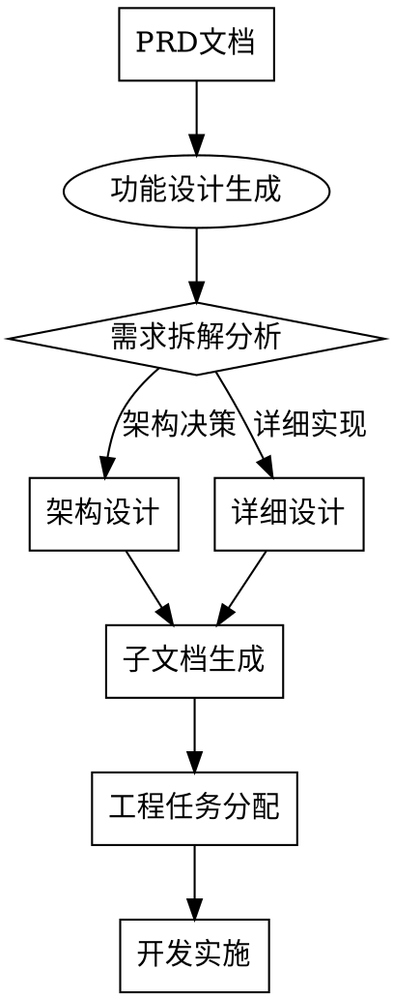

# Document-Dev - 功能设计文档管理独立技能

> 顶层设计是技术实现的蓝图，抓手是标准化设计模板，闭环是从PRD到详细设计的完整技术路径。

**⚠️ 设计不清晰就是技术债的源头。架构要拉通，边界要对齐。**

## 概述

`document-dev` 是松立研发文档管理系统的功能设计模块，负责将PRD需求转换为技术实现方案，创建详细的功能设计文档、架构规范和开发指南。作为工程流程的关键环节，确保技术实现与业务需求对齐。

## 核心功能

### 1. 功能设计生成
- **格式**: `/document-dev 生成 "功能描述"`
- **输入依赖**: 自动读取相关PRD文档作为输入
- **架构设计**: 设计系统架构、模块划分、数据流图
- **详细设计**: 设计关键算法、数据结构、接口规范
- **兼容性**: 同时支持 `/document dev 生成 "功能描述"` 格式

### 2. 子文档管理
- **格式**: `/document-dev 计划|任务|报告 [子命令]`
- **需求拆解(plans)**: 将PRD拆解为可执行的技术任务
- **任务分配(tasks)**: 创建开发任务和分配计划
- **测试验收报告(test report)**: 生成测试验收标准和报告模板
- **代码审查报告(review report)**: 生成代码审查标准和报告模板

### 3. 设计文档上传
- **格式**: `/document-dev 上传`
- **功能**: 上传设计文档到GitLab Wiki的 `dev/` 相关目录
- **结构化上传**: 按文档类型上传到对应子目录
- **版本关联**: 设计文档与PRD版本关联

### 4. 设计评审集成
- **格式**: `/document-dev 评审 [设计文档]`
- **代码审查集成**: 与现有代码审查技能集成
- **技术评审**: 组织技术评审会议和记录评审意见
- **设计优化**: 根据评审意见优化设计文档

## 工程流程集成

### 与PRD流程的深度集成

**核心原则**: 设计必须从PRD衍生，不能凭空设计。颗粒度要对齐。



### 与测试流程的集成
1. **测试用例生成**: 设计文档作为测试用例输入
2. **验收标准传递**: 设计验收标准同步到测试报告
3. **变更影响分析**: 设计变更对测试用例的影响分析

### 与项目管理的集成
1. **进度追踪**: 设计进度同步到项目概览
2. **风险识别**: 设计阶段识别的技术风险上报
3. **资源协调**: 设计阶段识别的资源需求协调

## 功能设计完整性检查表

**没有完整性的设计就是技术债。3.25必须对齐，owner意识要到位。**

- [ ] **设计目标对齐**: 设计目标与PRD需求完全对齐
- [ ] **架构合理性**: 架构设计合理，模块划分清晰
- [ ] **接口规范化**: 接口设计规范，数据格式明确
- [ ] **详细设计完整**: 关键算法、数据结构、状态流转完整
- [ ] **部署方案可行**: 部署方案完整，环境要求明确
- [ ] **性能考虑充分**: 性能设计考虑充分，指标可测量
- [ ] **安全设计到位**: 安全设计考虑全面，防护措施明确
- [ ] **可维护性设计**: 代码结构清晰，维护成本可控
- [ ] **可扩展性设计**: 架构支持未来扩展，耦合度合理
- [ ] **兼容性设计**: 兼容性考虑充分，升级路径明确

**任何一项缺失都必须补充，不能以"开发中优化"为借口。没有闭环就没有质量。**

## 功能设计模板

```markdown
# 功能设计文档

## 1. 设计目标
- **对齐PRD**: [相关PRD文档链接]
- **解决什么问题**: [具体问题描述]
- **达到什么效果**: [具体效果指标]
- **成功标准**: [可测量的成功标准]

## 2. 系统架构
- **模块划分**: [模块层次图]
- **数据流图**: [数据流向示意图]
- **接口设计**: [内部/外部接口设计]
- **技术栈选择**: [技术选型和理由]

## 3. 详细设计
- **关键算法**: [核心算法描述和伪代码]
- **数据结构**: [关键数据结构设计]
- **状态流转**: [系统状态机设计]
- **业务流程**: [具体业务流程图]

## 4. 接口规范
- **API设计**: [REST/GraphQL等API设计]
- **数据格式**: [请求/响应数据格式]
- **错误处理**: [错误码和错误处理机制]
- **认证授权**: [认证授权方案设计]

## 5. 部署方案
- **环境要求**: [开发/测试/生产环境要求]
- **部署步骤**: [详细部署步骤]
- **监控指标**: [关键监控指标定义]
- **运维方案**: [运维策略和应急方案]

## 6. 性能设计
- **性能指标**: [具体性能指标要求]
- **优化策略**: [性能优化策略]
- **压测方案**: [压力测试方案]
- **容量规划**: [容量评估和规划]

## 7. 安全设计
- **安全威胁**: [识别的主要安全威胁]
- **防护措施**: [具体防护措施]
- **合规要求**: [需要满足的合规要求]
- **审计日志**: [安全审计日志设计]

## 8. 测试设计
- **单元测试**: [单元测试策略]
- **集成测试**: [集成测试策略]
- **性能测试**: [性能测试策略]
- **安全测试**: [安全测试策略]

## 9. 风险评估
- **技术风险**: [技术实现风险]
- **进度风险**: [项目进度风险]
- **资源风险**: [资源需求风险]
- **应对策略**: [风险应对策略]
```

## 与superpowers技能深度集成

### 1. 与systematic-debugging集成
- **设计缺陷预防**: 在design阶段应用systematic-debugging方法论
- **根因分析**: 对复杂设计决策进行根因分析
- **验证闭环**: 设计验证形成闭环，不留隐患

### 2. 与test-driven-development集成
- **测试驱动设计**: 应用TDD思想进行API和接口设计
- **可测试性设计**: 设计阶段考虑可测试性
- **测试用例先行**: 重要接口先设计测试用例

### 3. 与code-review技能集成
- **设计评审**: 组织正式的设计评审会议
- **代码审查标准**: 基于设计制定代码审查标准
- **质量门禁**: 设计质量作为代码提交的门禁

### 4. 与document-pm集成
- **需求追溯**: 设计文档与PRD需求建立双向追溯
- **变更联动**: PRD变更时自动触发设计变更评估
- **状态同步**: 设计状态与PRD状态同步

## 常见的理性化漏洞及防护

| 漏洞 | 防护措施 |
|------|----------|
| "先开发后补文档" | **强制前置**: 没有设计文档不能开始开发 |
| "设计太细浪费时间" | **强制细节**: 设计不细就是技术债 |
| "架构可以后续优化" | **强制优化**: 架构问题必须在设计阶段解决 |
| "测试用例开发时再写" | **强制前置**: 测试设计必须同步 |
| "这个设计就内部用" | **强制标准**: 内部设计更要标准化 |

**理性化的本质是质量妥协。今天妥协一点，明天债台高筑。**

## 脚本库集成使用（推荐）

**底层逻辑**：标准化GitLab操作，统一错误处理，提升可维护性。

### 配置管理
所有document技能共享统一配置文件 `.sonli-spec-doc/config.json`：
```json
{
  "gitlab": {
    "repo": "团队/wit-parking-wiki",
    "host": "gitlab.com"
  },
  "version": {
    "current": "v1.0.0"
  }
}
```

### 脚本库位置
```
scripts/
├── gitlab/                    # GitLab核心库
│   ├── common.sh             # 公共函数：环境检查、路径处理、配置管理
│   ├── auth.sh               # 认证管理：登录、验证、令牌管理
│   └── wiki.sh               # Wiki操作：创建、更新、查看、删除
└── document/                 # 文档技能封装
    ├── document-pm-wrapper.sh  # PRD文档管理封装
    ├── document-dev-wrapper.sh # 功能设计文档管理封装（推荐使用）
    ├── init.sh               # 文档库初始化
    └── *.sh                  # 其他技能封装脚本
```

### 推荐使用方式
```bash
# 方式1：直接调用封装脚本（最推荐）
./scripts/document/document-dev-wrapper.sh upload 设计文档.md v1.0.0

# 方式2：在技能中引用脚本库
source scripts/gitlab/common.sh
source scripts/gitlab/auth.sh
source scripts/gitlab/wiki.sh
source scripts/document/document-dev-wrapper.sh

# 然后调用封装函数
init_document-dev
upload_document-dev_document "设计文档.md" "v1.0.0"
```

### 脚本库核心函数
- `check_glab_installed()` - GitLab CLI环境检查（从common.sh）
- `check_auth_status()` - 认证状态检查（从auth.sh）
- `glab_auth_interactive()` - 交互式GitLab认证（从auth.sh）
- `wiki_create()` - 创建或更新Wiki页面（从wiki.sh）
- `wiki_view()` - 查看Wiki页面（从wiki.sh）
- `init_document-dev()` - document-dev技能初始化（从wrapper）
- `upload_document-dev_document()` - 上传设计文档（从wrapper）
- `view_document-dev_document()` - 查看设计文档（从wrapper）

### document-dev技能专用封装脚本
`scripts/document/document-dev-wrapper.sh` 提供以下命令：
```bash
# 初始化技能
./scripts/document/document-dev-wrapper.sh init

# 上传设计文档
./scripts/document/document-dev-wrapper.sh upload <文件> [版本] [路径]

# 查看设计文档
./scripts/document/document-dev-wrapper.sh view [版本] [路径]

# 显示帮助
./scripts/document/document-dev-wrapper.sh help
```

### 向后兼容说明
- **旧方式**：手动执行GitLab命令（已过时）
- **新方式**：调用脚本库函数（推荐）
- **兼容层**：脚本库内部仍使用glab，但提供统一接口和更好的错误处理
- **路径兼容**：相对路径 `scripts/document/document-dev-wrapper.sh`

**优势**：
1. **标准化操作**：所有GitLab操作通过统一接口
2. **更好的错误处理**：脚本库提供详细的错误信息和恢复建议
3. **可维护性**：集中管理GitLab API调用逻辑
4. **可测试性**：独立的脚本便于单元测试和集成测试
5. **跨技能复用**：其他document技能可复用相同逻辑

## 性能指标

| 指标 | 目标值 | 说明 |
|------|--------|------|
| 设计生成时间 | < 30分钟 | 从PRD到完整设计文档 |
| 设计完整性 | > 95% | 设计完整性检查得分 |
| 评审通过率 | > 90% | 设计评审一次通过率 |
| 需求覆盖率 | 100% | PRD需求在设计中的覆盖率 |
| 变更影响度 | < 10% | 设计变更对已开发代码的影响 |

## 测试用例

### 设计质量测试
1. **完整性测试**: 验证设计文档的完整性
2. **一致性测试**: 验证设计与PRD的一致性
3. **可行性测试**: 验证设计方案的可行性

### 流程集成测试
1. **PRD→设计测试**: 验证PRD到设计的转换流程
2. **设计→开发测试**: 验证设计到开发的衔接流程
3. **变更传导测试**: 验证PRD变更对设计的影响传导

### 技能集成测试
1. **debugging集成测试**: 验证与systematic-debugging的集成
2. **TDD集成测试**: 验证与test-driven-development的集成
3. **review集成测试**: 验证与code-review技能的集成

---
**子智能体标识**: document-dev-agent  
**版本**: 2.0.0  
**创建时间**: 2026-04-22  
**依赖**: GitLab CLI、superpowers脚本库、PRD文档、superpowers技能集  
**状态**: 就绪  
**owner**: 架构师/技术负责人