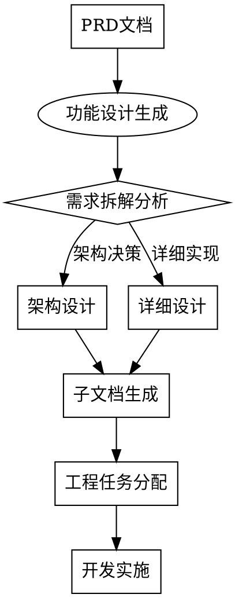

# Document-Dev - 功能设计文档管理独立技能

> 顶层设计是技术实现的蓝图，抓手是标准化设计模板，闭环是从PRD到详细设计的完整技术路径。

**⚠️ 设计不清晰就是技术债的源头。架构要拉通，边界要对齐。**

## 概述

`document-dev` 是松立研发文档管理系统的功能设计模块，负责将PRD需求转换为技术实现方案，创建详细的功能设计文档、架构规范和开发指南。作为工程流程的关键环节，确保技术实现与业务需求对齐。

## ⛳ 初始化配置前置检查（强制）

**执行任何 `/document-dev` 子命令前，必须先完成初始化检查**。未初始化时立即中止当前操作，引导用户执行 `/document-init`，严禁绕过。

### 必检项

- [ ] 当前处于 Git 仓库（`git rev-parse --show-toplevel` 可成功）
- [ ] `.sonli-spec-doc/config.yaml` 存在
- [ ] `storage.mode == git_repo`
- [ ] `directories.active_plan` 已设置（非空）
- [ ] `.sonli-spec-doc/<active_plan>/dev/{plans,tasks,review-report,test-report}/` 目录存在
- [ ] `.sonli-spec-doc/scripts/sync-from-remote.sh` 可用 → **pre-check 自动执行**，拉取远端最新 PRD 和设计文档（已有跳过，新文件补齐；`--force` 强制覆盖）

### 检查脚本（AI 执行此逻辑）

```bash
REPO_ROOT=$(git rev-parse --show-toplevel 2>/dev/null) || { echo "❌ 当前不在 Git 仓库"; exit 1; }
cd "$REPO_ROOT"

CONFIG=".sonli-spec-doc/config.yaml"
[ -f "$CONFIG" ] || { echo "❌ 未检测到 $CONFIG，请先执行 /document-init '<月度计划名>'"; exit 1; }

ACTIVE_PLAN=$(grep -E '^[[:space:]]*active_plan:' "$CONFIG" | head -1 | cut -d: -f2- | cut -d'#' -f1 | tr -d '"' | tr -d "'" | xargs)
[ -n "$ACTIVE_PLAN" ] || { echo "❌ active_plan 未设置，请执行 /document-init plan '<月度计划名>'"; exit 1; }

for sub in plans tasks review-report test-report; do
  [ -d ".sonli-spec-doc/$ACTIVE_PLAN/dev/$sub" ] || { echo "❌ 设计目录缺失：.sonli-spec-doc/$ACTIVE_PLAN/dev/$sub，请重新执行 /document-init '$ACTIVE_PLAN'"; exit 1; }
done

echo "✅ Dev 初始化配置检查通过（活跃计划：$ACTIVE_PLAN）"
```

### 未通过时的统一响应

```
⚠️ 未检测到文档初始化配置（或活跃月度计划未设置）
原因：<config.yaml 缺失 | active_plan 未配置 | dev 子目录缺失>
建议：
  1. /document-init '2026年4月月度计划'   ← 首次初始化
  2. /document-init plan '2026年4月月度计划' ← 仅切换活跃计划
完成后请重新执行本命令。
  3. ./scripts/sync-from-remote.sh          ← 自动拉取远端最新文档（已有跳过，--force 强制覆盖）
```

### 理性化防护

| 漏洞 | 防护 |
|------|------|
| "先写设计文档，事后再初始化" | 禁止：无 active_plan 时设计文档无法关联月度计划 |
| "手动创建 config.yaml 绕过检查" | 禁止：必须通过 `/document-init` 保证目录结构标准化和配置一致性 |
| "设计放在 PRD 同目录下" | 禁止：设计必须进 `dev/plans`，便于评审和追溯 |
| "远端有设计文档但本地没有，直接写新的" | **禁止**：设计前必须先执行 `sync-from-remote.sh` 拉取最新 PRD 和设计文档，确保上下游一致 |

## 核心功能

### 1. 功能设计生成
- **格式**: `/document-dev 生成 "功能描述"`
- **输入依赖**: 自动读取相关PRD文档作为输入
- **架构设计**: 设计系统架构、模块划分、数据流图
- **详细设计**: 设计关键算法、数据结构、接口规范
- **兼容性**: 同时支持 `/document dev 生成 "功能描述"` 格式

### 2. 子文档管理
- **格式**: `/document-dev 计划|任务|报告 [子命令]`
- **需求拆解(plans)**: 将PRD拆解为可执行的技术任务
- **任务分配(tasks)**: 创建开发任务和分配计划
- **测试验收报告(test report)**: 生成测试验收标准和报告模板
- **代码审查报告(review report)**: 生成代码审查标准和报告模板

### 3. 设计文档提交
- **格式**: `/document-dev 提交 [描述] [--paths <src>]`
- **功能**: 将设计文档写入 `.sonli-spec-doc/<活跃计划>/dev/` 对应子目录，并推送到远端
- **版本关联**: 通过文件命名和目录结构关联设计文档与 PRD 版本
- **意图补全**: AI 根据用户描述自动推断 `--dest` 远程目录（见下方映射表）

#### 路径意图映射表（document-dev 自动补全规则）

当用户执行 `/document-dev 提交 <描述> --paths <source>` 时，AI **必须**根据描述中的关键词自动推断远程目标目录，构造 `source:dest` 语法：

| 用户意图关键词 | 推断的 --dest 模式 | 示例 |
|---------------|---------------------|------|
| 接口文档 / api / API | `dev/api/<需求名称>` | `提交法定节假日接口文档 --paths api-output` → `--paths "api-output:dev/api/法定节假日禁止用券"` |
| 测试报告 / 测试验收 / test-report | `dev/test-report/<需求名称>` | `提交法定节假日测试报告 --paths dogfood-output` → `--paths "dogfood-output:dev/test-report/法定节假日禁止用券"` |
| 设计文档 / 功能设计 / plans | `dev/plans/<需求名称>` | `提交用户登录设计文档 --paths design-out` → `--paths "design-out:dev/plans/用户登录"` |
| 评审报告 / review | `dev/review-report/<需求名称>` | `提交用户登录评审报告 --paths review-out` → `--paths "review-out:dev/review-report/用户登录"` |
| 任务 / tasks | `dev/tasks/<需求名称>` | `提交用户登录任务 --paths task-out` → `--paths "task-out:dev/tasks/用户登录"` |

**补全逻辑**：
1. 提取用户描述中的**意图关键词**（接口文档/测试报告/设计文档/评审报告/任务）→ 确定目录类别
2. 提取用户描述中的**需求名称**（如"法定节假日"→"法定节假日禁止用券"，需匹配实际 PRD 文件名中的简称）
3. 构造 `--paths "<source>:<目录类别>/<需求名称>"` 传给 `sync-to-remote.sh`
4. 需求名称提取规则：从用户描述中提取核心功能词，匹配 `.sonli-spec-doc/<active_plan>/pm/prd/` 下已有的 PRD 文件名，取匹配的简称；无匹配 PRD 时使用描述中的关键词
5. 无法匹配意图关键词时，使用 `source` 作为 `dest`（兼容旧行为）
6. 用户显式指定 `source:dest` 时，以用户指定为准

### 4. 设计评审集成
- **格式**: `/document-dev 评审 [设计文档]`
- **代码审查集成**: 与现有代码审查技能集成
- **技术评审**: 组织技术评审会议和记录评审意见
- **设计优化**: 根据评审意见优化设计文档

## 执行工作流（AI 必须遵循）

**当用户调用 `/document-dev 创建设计文档`、`/document-dev 生成 "功能描述"` 或任何涉及设计文档生成的子命令时，AI 必须严格按以下步骤执行。不可跳步、不可省略自检。**

### 步骤 1：前置检查 + 远端同步

执行「⛳ 初始化配置前置检查」中的必检项和检查脚本，通过后执行 `sync-from-remote.sh` 拉取远端最新 PRD 和设计文档。

未通过时输出统一响应，中止执行。

### 步骤 2：PRD 识别与读取

1. **扫描 PRD 目录**：列出 `.sonli-spec-doc/<active_plan>/pm/prd/` 下所有 `.md` 文件
2. **确定目标 PRD**：
   - 若用户指定了功能描述（如 `/document-dev 生成 "用户登录"`），匹配文件名包含该关键词的 PRD
   - 若用户未指定（如 `/document-dev 创建设计文档`），扫描哪些 PRD 缺少对应设计文档（`dev/plans/` 下无同名设计文档），列出供用户选择
   - 若所有 PRD 均已有设计文档，提示用户指定要重新设计或新增的 PRD
3. **读取目标 PRD 全文**，提取以下要素到结构化摘要：

```
PRD 要素提取模板：
├── 需求背景：业务背景 + 问题描述 + 影响范围
├── 核心目标：成功标准 + 验收条件
├── 功能点列表：每个功能点的用户故事 + 验收标准
├── 非功能需求：性能 + 安全 + 兼容性
├── 交付计划：里程碑 + 资源 + 风险
└── 术语定义：业务术语 + 技术术语
```

### 步骤 3：需求拆解（PRD → 技术设计单元）

将 PRD 中每个功能点拆解为可独立设计的技术单元。拆解颗粒度原则：
- 每个技术单元对应 1 个组件/模块/接口的修改
- 每个技术单元可在 1 个设计小节中完整描述
- 拆解结果以表格形式呈现，等待用户确认

```
需求拆解输出格式：
| # | PRD 功能点 | 技术设计单元 | 涉及文件/模块 | 优先级 |
|---|-----------|-------------|-------------|--------|
| 1 | 手机号验证码登录 | 验证码发送组件 | auth/SmsCode.vue | P0 |
| 2 | 手机号验证码登录 | 登录接口调用 | auth/loginApi.ts | P0 |
| ... | ... | ... | ... | ... |
```

**等待用户确认拆解结果**，确认后进入步骤 4。用户可调整拆解颗粒度或增删设计单元。

### 步骤 4：架构设计

基于确认的拆解结果，设计系统架构：

1. **模块划分**：明确各技术单元的模块归属和层次关系
2. **数据流图**：描述数据在各模块间的流转路径
3. **技术选型**：列出技术栈选择及理由（复用现有技术栈优先）
4. **模块间接口约定**：定义模块间的数据契约（输入/输出格式）

输出格式参照模板「2. 系统架构」章节。

### 步骤 5：详细设计

对每个技术设计单元，逐一展开详细设计：

1. **响应式数据设计**：定义组件所需的 ref/state 结构
2. **核心逻辑设计**：关键函数的伪代码或逻辑描述
3. **模板结构设计**：组件 DOM 结构树（缩进表示层级）
4. **数据提交设计**：表单数据如何组装为接口入参
5. **重置/清理逻辑**：组件卸载或取消时的状态清理

输出格式参照模板「3. 详细设计」章节。

### 步骤 6：接口规范

1. **入参定义**：字段名、类型、必填、格式、示例
2. **返参定义**：字段名、类型、说明、示例
3. **前端处理规则**：数据如何映射到界面展示
4. **错误处理**：异常场景的前端降级策略

输出格式参照模板「4. 接口规范」章节。

### 步骤 7：补充设计（按需）

根据项目实际情况，补充以下章节（不能以"后续补充"为借口跳过）：

- **部署方案**（第5章）：环境要求、构建验证命令
- **性能设计**（第6章）：关键路径性能预估、优化策略
- **安全设计**（第7章）：输入校验、数据防护、审计日志
- **测试设计**（第8章）：功能测试要点、边界条件、异常场景
- **风险评估**（第9章）：技术风险、进度风险、应对策略

### 步骤 8：完整性自检

设计文档完成后，**强制执行以下自检**，逐项确认：

```
设计文档完整性自检表：
- [ ] 设计目标与 PRD 需求完全对齐（每个 PRD 功能点都有对应设计）
- [ ] 架构合理性：模块划分清晰，无循环依赖
- [ ] 涉及文件/模块已明确列出
- [ ] 接口规范完整：入参+返参+前端处理规则
- [ ] 详细设计到函数级：响应式数据+核心逻辑+模板结构
- [ ] 边界条件已覆盖（空值、异常、极端场景）
- [ ] 非功能需求有对应设计方案（性能+安全）
- [ ] 风险已识别且有应对策略
```

**任何一项不通过，必须补充设计，不能标记完成。**

### 步骤 9：写入文件 + 同步

1. **文件命名**：`<功能简称>-功能设计.md`（如 `用户登录-功能设计.md`）
2. **存储路径**：`.sonli-spec-doc/<active_plan>/dev/plans/<功能简称>-功能设计.md`
3. **写入文件**：将完整设计文档写入上述路径
3. **可选远端同步**：提示用户是否执行 `sync-to-remote.sh` 推送到 Spec Doc 远程仓库
   - 支持路径意图映射：`--paths "dogfood-output:dev/test-report"` 将本地 dogfood-output 上传到远程 dev/test-report
   - 也支持 `--paths dogfood-output --dest dev/test-report` 等效写法
   - 不指定 dest 时，默认使用 source 作为远程目录名

### 步骤 10：输出确认

```
✅ 设计文档已生成
   文件：.sonli-spec-doc/<active_plan>/dev/plans/<功能简称>-功能设计.md
   对齐PRD：<PRD文件名>
   技术单元数：<N>个
   完整性自检：<通过项>/8
   
   下一步建议：
   1. /document-dev 评审              ← 设计评审
   2. /document-test 生成 "<功能描述>" ← 生成测试用例
   3. ./sync-to-remote.sh --paths "local-dir:remote-dest"  ← 自定义路径推送到指定远程目录
   4. ./sync-to-remote.sh --paths local-dir --dest remote-dest ← 同上，等效写法
```

---

## 与 writing-plans 技能集成（实施计划创建优先使用）

**当 `/document-dev 创建设计文档` 或 `/document-dev 生成 "功能描述"` 执行到步骤 3（需求拆解）并经用户确认后，必须优先使用 `superpowers:writing-plans` 技能的方法论来生成实施计划。**

### 为什么要集成 writing-plans

| 对比项 | 传统设计文档 | writing-plans 方法论 |
|--------|------------|-------------------|
| 任务粒度 | 按模块/组件描述 | bite-sized（2-5分钟/步）|
| 代码完整度 | 伪代码/设计描述 | 完整可执行代码 |
| 测试策略 | 测试要点列表 | TDD：写失败测试→验证失败→实现→验证通过→提交 |
| 占位符 | 允许 "后续补充" | **禁止** 任何 TBD/TODO/"后续实现" |
| 文件精度 | 模块级路径 | 精确到行号（`file.py:123-145`） |
| 执行追踪 | 无 | checkbox（`- [ ]`）语法 |

### 集成执行流程

步骤 1~3（前置检查 + PRD 读取 + 需求拆解）→ **用户确认拆解** → 调用 `writing-plans` 生成实施计划 → 步骤 8~10（自检 + 写入 + 确认）

具体地，步骤 3 用户确认拆解后：

1. **调用 writing-plans 技能**：将确认的拆解结果和 PRD 全文作为输入
2. **writing-plans 生成实施计划**，遵循以下规则：
   - **计划头部**：必须包含 Goal、Architecture、Tech Stack 摘要
   - **文件结构映射**：先定义所有涉及的文件及其职责，再定义任务
   - **Task 粒度**：每个 Task 包含多个 Step，每个 Step 是一个 2-5 分钟的原子操作
   - **TDD 步骤**：写失败测试 → 运行验证失败 → 写最小实现 → 运行验证通过 → 提交
   - **完整代码**：每个 Step 必须包含实际代码，绝不使用占位符
   - **精确路径**：`Create:` / `Modify: path/to/file:行号` / `Test: path/to/test`
   - **Self-Review**：计划完成后执行自检（spec 覆盖度、占位符扫描、类型一致性）
3. **存储路径**：实施计划写入 `.sonli-spec-doc/<active_plan>/dev/plans/<功能简称>-实施计划.md`
4. **执行交接**：计划完成后提示用户选择执行方式：
   - **Subagent-Driven（推荐）**：使用 `superpowers:subagent-driven-development`，每个 Task 派发独立 subagent
   - **Inline Execution**：使用 `superpowers:executing-plans`，批量执行+检查点

### 实施计划文档头部模板

```markdown
# [功能名称] 实施计划

> **For agentic workers:** REQUIRED SUB-SKILL: Use superpowers:subagent-driven-development (recommended) or superpowers:executing-plans to implement this plan task-by-task. Steps use checkbox (`- [ ]`) syntax for tracking.

**Goal:** [一句话描述构建目标]

**Architecture:** [2-3 句架构方法]

**Tech Stack:** [关键技术/库]

**对齐PRD:** `.sonli-spec-doc/<active_plan>/pm/prd/<PRD文件名>.md`

**对齐设计:** `.sonli-spec-doc/<active_plan>/dev/plans/<功能设计文件名>.md`

---
```

### 实施计划 Task 结构模板

````markdown
### Task N: [组件名称]

**Files:**
- Create: `exact/path/to/file.ts`
- Modify: `exact/path/to/existing.vue:123-145`
- Test: `tests/exact/path/to/test.ts`

- [ ] **Step 1: 写失败测试**

```typescript
describe('组件名', () => {
  it('应该正确处理XX', () => {
    // 测试代码
  })
})
```

- [ ] **Step 2: 运行测试验证失败**

Run: `pnpm test path/to/test`
Expected: FAIL

- [ ] **Step 3: 写最小实现**

```typescript
// 完整实现代码
```

- [ ] **Step 4: 运行测试验证通过**

Run: `pnpm test path/to/test`
Expected: PASS

- [ ] **Step 5: 提交**

```bash
git add path/to/files
 git commit -m "feat: 描述"
```
````

### 禁止的占位符模式

实施计划中绝不允许出现以下内容：
- "TBD"、"TODO"、"后续实现"、"fill in details"
- "添加适当的错误处理" / "添加验证" / "处理边界情况"（必须给出实际代码）
- "为上述代码写测试"（必须给出实际测试代码）
- "类似 Task N"（必须重复代码，因为 subagent 可能乱序执行）
- 只有描述没有代码的步骤

---

## 命令路由表

| 用户输入 | 匹配规则 | 执行动作 |
|---------|---------|--------|
| `/document-dev 创建设计文档` | 未指定功能 | 扫描缺少设计的 PRD → 用户选择 → 步骤1~3 → **writing-plans 生成实施计划** → 步骤8~10 |
| `/document-dev 生成 "功能描述"` | 指定功能关键词 | 匹配 PRD → 步骤1~3 → **writing-plans 生成实施计划** → 步骤8~10 |
| `/document-dev 提交` | 提交已有设计 | 执行 sync-to-remote.sh 推送 |
| `/document-dev 提交 <描述> --paths <src>` | 提交自定义路径 | 根据意图映射表自动补全 dest，构造 `src:dest` 推送 |
| `/document-dev 提交 <描述> --paths <src>:<dest>` | 显式指定远程目录 | 用户指定为准，不自动补全 |
| `/document-dev 评审 [文档]` | 设计评审 | 读取设计文档 + PRD → 一致性审查 |
| `/document-dev 计划` | 需求拆解 | 仅执行步骤1~3 + **writing-plans 生成实施计划** |
| `/document-dev 任务` | 任务分配 | 读取设计文档 → 生成任务分配文档到 `dev/tasks/` |

---

## 工程流程集成

### 与PRD流程的深度集成

**核心原则**: 设计必须从PRD衍生，不能凭空设计。颗粒度要对齐。


```dot
digraph dev_integration {
    "PRD文档" [shape=box];
    "功能设计生成" [shape=ellipse];
    "需求拆解分析" [shape=diamond];
    "架构设计" [shape=box];
    "详细设计" [shape=box];
    "子文档生成" [shape=box];
    "工程任务分配" [shape=box];
    "开发实施" [shape=box];

    "PRD文档" -> "功能设计生成";
    "功能设计生成" -> "需求拆解分析";
    "需求拆解分析" -> "架构设计" [label="架构决策"];
    "需求拆解分析" -> "详细设计" [label="详细实现"];
    "架构设计" -> "子文档生成";
    "详细设计" -> "子文档生成";
    "子文档生成" -> "工程任务分配";
    "工程任务分配" -> "开发实施";
}
```

### 与测试流程的集成
1. **测试用例生成**: 设计文档作为测试用例输入
2. **验收标准传递**: 设计验收标准同步到测试报告
3. **变更影响分析**: 设计变更对测试用例的影响分析

### 与项目管理的集成
1. **进度追踪**: 设计进度同步到项目概览
2. **风险识别**: 设计阶段识别的技术风险上报
3. **资源协调**: 设计阶段识别的资源需求协调

## 功能设计完整性检查表

**没有完整性的设计就是技术债。3.25必须对齐，owner意识要到位。**

- [ ] **设计目标对齐**: 设计目标与PRD需求完全对齐
- [ ] **架构合理性**: 架构设计合理，模块划分清晰
- [ ] **接口规范化**: 接口设计规范，数据格式明确
- [ ] **详细设计完整**: 关键算法、数据结构、状态流转完整
- [ ] **部署方案可行**: 部署方案完整，环境要求明确
- [ ] **性能考虑充分**: 性能设计考虑充分，指标可测量
- [ ] **安全设计到位**: 安全设计考虑全面，防护措施明确
- [ ] **可维护性设计**: 代码结构清晰，维护成本可控
- [ ] **可扩展性设计**: 架构支持未来扩展，耦合度合理
- [ ] **兼容性设计**: 兼容性考虑充分，升级路径明确

**任何一项缺失都必须补充，不能以"开发中优化"为借口。没有闭环就没有质量。**

## 功能设计模板

```markdown
# 功能设计文档

## 1. 设计目标
- **对齐PRD**: [相关PRD文档链接]
- **解决什么问题**: [具体问题描述]
- **达到什么效果**: [具体效果指标]
- **成功标准**: [可测量的成功标准]

## 2. 系统架构
- **模块划分**: [模块层次图]
- **数据流图**: [数据流向示意图]
- **接口设计**: [内部/外部接口设计]
- **技术栈选择**: [技术选型和理由]

## 3. 详细设计
- **关键算法**: [核心算法描述和伪代码]
- **数据结构**: [关键数据结构设计]
- **状态流转**: [系统状态机设计]
- **业务流程**: [具体业务流程图]

## 4. 接口规范
- **API设计**: [REST/GraphQL等API设计]
- **数据格式**: [请求/响应数据格式]
- **错误处理**: [错误码和错误处理机制]
- **认证授权**: [认证授权方案设计]

## 5. 部署方案
- **环境要求**: [开发/测试/生产环境要求]
- **部署步骤**: [详细部署步骤]
- **监控指标**: [关键监控指标定义]
- **运维方案**: [运维策略和应急方案]

## 6. 性能设计
- **性能指标**: [具体性能指标要求]
- **优化策略**: [性能优化策略]
- **压测方案**: [压力测试方案]
- **容量规划**: [容量评估和规划]

## 7. 安全设计
- **安全威胁**: [识别的主要安全威胁]
- **防护措施**: [具体防护措施]
- **合规要求**: [需要满足的合规要求]
- **审计日志**: [安全审计日志设计]

## 8. 测试设计
- **单元测试**: [单元测试策略]
- **集成测试**: [集成测试策略]
- **性能测试**: [性能测试策略]
- **安全测试**: [安全测试策略]

## 9. 风险评估
- **技术风险**: [技术实现风险]
- **进度风险**: [项目进度风险]
- **资源风险**: [资源需求风险]
- **应对策略**: [风险应对策略]
```

## 与superpowers技能深度集成

### 1. 与systematic-debugging集成
- **设计缺陷预防**: 在design阶段应用systematic-debugging方法论
- **根因分析**: 对复杂设计决策进行根因分析
- **验证闭环**: 设计验证形成闭环，不留隐患

### 2. 与test-driven-development集成
- **测试驱动设计**: 应用TDD思想进行API和接口设计
- **可测试性设计**: 设计阶段考虑可测试性
- **测试用例先行**: 重要接口先设计测试用例

### 3. 与code-review技能集成
- **设计评审**: 组织正式的设计评审会议
- **代码审查标准**: 基于设计制定代码审查标准
- **质量门禁**: 设计质量作为代码提交的门禁

### 4. 与document-pm集成
- **需求追溯**: 设计文档与PRD需求建立双向追溯
- **变更联动**: PRD变更时自动触发设计变更评估
- **状态同步**: 设计状态与PRD状态同步

## 常见的理性化漏洞及防护

| 漏洞 | 防护措施 |
|------|----------|
| "先开发后补文档" | **强制前置**: 没有设计文档不能开始开发 |
| "设计太细浪费时间" | **强制细节**: 设计不细就是技术债 |
| "架构可以后续优化" | **强制优化**: 架构问题必须在设计阶段解决 |
| "测试用例开发时再写" | **强制前置**: 测试设计必须同步 |
| "这个设计就内部用" | **强制标准**: 内部设计更要标准化 |

**理性化的本质是质量妥协。今天妥协一点，明天债台高筑。**

## Git 提交使用方式

```bash
# 生成设计文档（AI 写入对应目录）
DEV_PATH=".sonli-spec-doc/$(get_active_plan)/dev"

# AI 将设计文档内容写入 $DEV_PATH/<子目录>/<功能名>.md
```

## 性能指标

| 指标 | 目标值 | 说明 |
|------|--------|------|
| 设计生成时间 | < 30分钟 | 从PRD到完整设计文档 |
| 设计完整性 | > 95% | 设计完整性检查得分 |
| 评审通过率 | > 90% | 设计评审一次通过率 |
| 需求覆盖率 | 100% | PRD需求在设计中的覆盖率 |
| 变更影响度 | < 10% | 设计变更对已开发代码的影响 |

## 测试用例

### 设计质量测试
1. **完整性测试**: 验证设计文档的完整性
2. **一致性测试**: 验证设计与PRD的一致性
3. **可行性测试**: 验证设计方案的可行性

### 流程集成测试
1. **PRD→设计测试**: 验证PRD到设计的转换流程
2. **设计→开发测试**: 验证设计到开发的衔接流程
3. **变更传导测试**: 验证PRD变更对设计的影响传导

### 技能集成测试
1. **debugging集成测试**: 验证与systematic-debugging的集成
2. **TDD集成测试**: 验证与test-driven-development的集成
3. **review集成测试**: 验证与code-review技能的集成

---
**子智能体标识**: document-dev-agent  
**版本**: 2.0.0  
**创建时间**: 2026-04-22  
**依赖**: GitLab CLI、superpowers脚本库、PRD文档、superpowers技能集  
**状态**: 就绪  
**owner**: 架构师/技术负责人