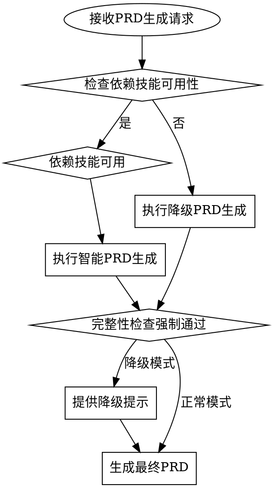

# Document-PM - PRD文档管理独立技能

> 顶层设计是精准的需求表达，抓手是智能PRD生成，闭环是从需求澄清到文档上传的完整流程。

**⚠️ 需求不明确就是最大的技术债。颗粒度必须拉到函数级，不能模糊。**

## 概述

`document-pm` 是松立研发文档管理系统的产品需求文档管理模块，专门负责PRD（产品需求文档）的智能生成、质量评估、版本管理和GitLab Wiki上传。作为独立的技能模块，它专注于产品需求的文档化表达和团队协作。

## 核心功能

### 1. 智能PRD生成
- **格式**: `/document-pm 生成 "需求描述"`
- **智能澄清**: 询问是否需要 `/brainstorming`、`/office-hours`、`gstack` 等技能辅助
- **自适应模板**: 基于澄清结果生成精准PRD
- **完整性检查**: 强制包含需求背景、目标、功能需求、验收标准等章节
- **兼容性**: 同时支持 `/document pm 生成 "需求描述"` 格式

### 2. PRD 提交管理
- **格式**: `/document-pm 提交`
- **功能**: 将 PRD 提交到仓库 `docs/monthly/<活跃计划>/pm/prd/` 目录
- **版本控制**: 通过 Git 历史追踪每次变更（自动生成 commit message）
- **命令示例**:
  ```bash
  git add docs/monthly/<活跃计划>/pm/prd/<文件名>.md
  git commit -m "docs(pm): update PRD - <功能名称> v<版本号>"
  git push
  ```

### 3. PRD版本管理
- **格式**: `/document-pm 版本 [查看|回滚]`
- **功能**: 查看PRD历史版本，支持版本回滚
- **变更追踪**: 记录每次PRD变更内容和原因
- **审核追踪**: 记录评审意见和修改建议

### 4. PRD质量评估
- **格式**: `/document-pm 评估 [文档路径]`
- **功能**: 自动评估PRD完整性、一致性和可读性
- **评分体系**: 完整性评分、清晰度评分、可行性评分
- **改进建议**: 提供具体的改进建议和优化方向

## 智能降级策略

### 依赖技能不可用时的降级方案

**核心原则**: 不能因为依赖技能缺失而放弃核心功能。因为信任所以简单，但要先有底线功能。

| 依赖技能 | 降级方案 | 降级提示 |
|----------|----------|----------|
| `/brainstorming` 不可用 | **基础澄清模板**: 使用标准澄清问题列表 | "使用基础需求澄清模板，建议后续使用/brainstorming更彻底澄清" |
| `/office-hours` 不可用 | **PM视角检查表**: 使用PM checklist替代 | "使用PM视角检查表，建议后续使用/office-hours更深入review" |
| `gstack` 不可用 | **技术可行性模板**: 使用通用技术评估模板 | "使用通用技术评估模板，建议后续集成gstack更精确评估" |
| GitLab连接失败 | 无需网络：文档直接写入本地 `docs/` 目录，`git push` 时再同步 | - |

### 智能降级流程图



**底线要求**: 无论依赖技能是否可用，PRD完整性检查必须强制执行，核心章节不能缺失。

## 脚本库集成使用（推荐）

### 推荐使用方式
```bash
# 生成 PRD 文档（AI 根据需求自动写入文件）
DOCS_PATH="docs/monthly/$(get_active_plan)/pm/prd"
mkdir -p "$DOCS_PATH"
# AI 将 PRD 内容写入 $DOCS_PATH/<功能名>.md

# 提交到仓库
git add "$DOCS_PATH/"
git commit -m "docs(pm): add PRD - <功能名称>"
git push
```


**优势**：
1. **标准化操作**：所有GitLab操作通过统一接口
2. **更好的错误处理**：脚本库提供详细的错误信息和恢复建议
3. **可维护性**：集中管理GitLab API调用逻辑
4. **可测试性**：独立的脚本便于单元测试和集成测试
5. **跨技能复用**：其他document技能可复用相同逻辑

## PRD完整性检查表

**没有完整性的PRD就是技术债的根源。3.25必须对齐，颗粒度要细。**

- [ ] **需求背景**: 业务背景、问题描述、影响范围
- [ ] **目标与范围**: 核心目标、成功标准、验收条件
- [ ] **功能需求**: 功能点（颗粒度到函数级）、用户故事、业务流程
- [ ] **非功能需求**: 性能要求、安全要求、兼容性要求
- [ ] **验收标准**: 功能验收标准、性能验收标准、用户体验标准
- [ ] **交付计划**: 里程碑、资源需求、风险管控
- [ ] **术语定义**: 业务术语、技术术语、缩写说明
- [ ] **原型/设计**: UI/UX设计引用、交互流程描述

**任何一项缺失都必须补充，不能以"后续补充"为借口。没有owner意识就没有闭环。**

## PRD模板结构

```markdown
# 产品需求文档

## 1. 需求背景
- 业务背景
- 问题描述  
- 影响范围

## 2. 目标与范围
- 核心目标
- 成功标准
- 验收条件
- 范围边界

## 3. 功能需求
- 功能点1（颗粒度到函数级）
  - 用户故事
  - 业务流程
  - 输入输出
  - 异常处理
- 功能点2...

## 4. 非功能需求
- 性能要求
- 安全要求
- 兼容性要求
- 可用性要求

## 5. 验收标准
- 功能验收标准
- 性能验收标准  
- 用户体验标准
- 安全合规标准

## 6. 交付计划
- 关键里程碑
- 资源需求
- 风险管控
- 依赖项管理

## 7. 术语定义
- 业务术语
- 技术术语
- 缩写说明

## 8. 原型/设计
- UI/UX设计引用
- 交互流程描述
- 视觉规范说明
```

## 常见的理性化漏洞及防护

| 漏洞 | 防护措施 |
|------|----------|
| "需求不明确，先写个大概" | **强制澄清**: 使用澄清模板或建议/brainstorming |
| "依赖技能用不了，不生成PRD了" | **强制降级**: 使用基础模板，保持核心功能 |
| "验收标准太细，先写功能吧" | **强制标准**: 验收标准必须颗粒化、可测量 |
| "这个PRD就内部用，不用太详细" | **强制详细**: 内部文档更要详细，方便后续维护 |
| "时间太紧，先上传后补文档" | **强制前置**: 文档不完整不能进入开发阶段 |

**理性化的本质是技术债的预支。今天不闭环，明天就难还债。**

## 与工程流程集成

### 与document-dev集成
1. **需求传递**: PRD生成后自动触发`/document-dev`进行功能设计
2. **变更同步**: PRD变更时通知相关设计文档更新
3. **状态追踪**: PRD状态同步到项目概览(`/document-overview`)

### 与document-test集成
1. **验收标准传递**: PRD验收标准自动转换为测试用例
2. **需求覆盖验证**: 验证测试用例对PRD需求的覆盖率
3. **变更影响分析**: PRD变更对测试用例的影响分析

### 与document-compound集成
1. **经验收集**: PRD开发过程自动收集为开发经验
2. **模式识别**: 识别重复的PRD模式，沉淀为模板
3. **知识沉淀**: PRD最佳实践自动沉淀到知识库

## 性能指标

| 指标 | 目标值 | 说明 |
|------|--------|------|
| PRD生成时间 | < 2分钟 | 从接收到需求到生成完整PRD |
| 降级成功率 | 100% | 依赖技能缺失时核心功能依然可用 |
| 完整性评分 | > 90% | PRD完整性检查平均得分 |
| 上传成功率 | > 95% | PRD上传到GitLab Wiki成功率 |
| 版本管理 | 100% | 每次PRD变更都有版本记录 |

## 测试用例

### 单元测试
1. **PRD生成测试**: 验证各种需求场景的PRD生成
2. **降级策略测试**: 验证依赖技能缺失时的降级方案
3. **完整性检查测试**: 验证PRD完整性检查的正确性

### 集成测试
1. **技能集成测试**: 验证与/brainstorming、/office-hours等技能的集成
2. **流程集成测试**: 验证PRD→设计→测试→总结的完整流程
3. **降级集成测试**: 验证各种降级场景下的流程完整性

### 压力测试
1. **时间压力测试**: 时间紧迫时的PRD生成质量
2. **依赖压力测试**: 多个依赖技能缺失时的降级能力
3. **质量压力测试**: 需求模糊不清时的澄清能力

---
**子智能体标识**: document-pm-agent  
**版本**: 2.0.0  
**创建时间**: 2026-04-22  
**依赖**: GitLab CLI、superpowers脚本库、可选superpowers技能  
**状态**: 就绪  
**owner**: PRD产品经理