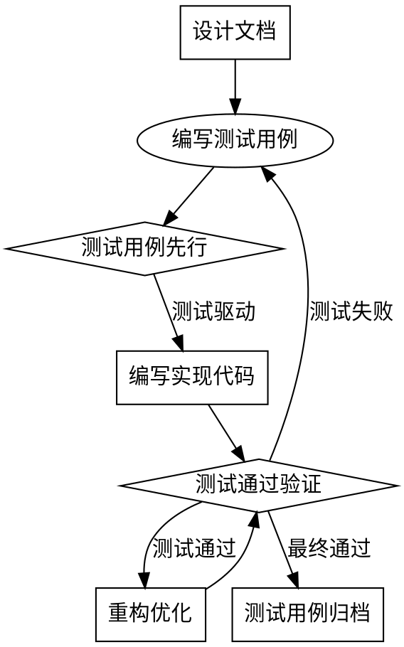

# Document-Test - 测试文档管理独立技能

> 顶层设计是质量保障的基石，抓手是标准化测试模板，闭环是从需求到验证的完整测试流程。

**⚠️ 测试不充分就是质量隐患。覆盖要全面，用例要可测。**

## 概述

`document-test` 是松立研发文档管理系统的测试文档模块，负责测试用例设计、测试计划编制和测试报告生成。作为软件开发质量保障的关键环节，确保测试文档的标准化和完整性。

## 与test-driven-development深度集成

### TDD核心原则在测试设计中的应用

**⚠️ 红牌警告**: 没有测试的设计都是技术债。TDD不是选项，是必须。



**强制TDD流程**: 
1. **测试先行**: 所有功能必须先从测试用例开始
2. **用例可执行**: 测试用例必须可执行，不能是描述性文档
3. **失败验证**: 新功能开发前必须看到测试失败
4. **通过验证**: 实现后必须看到测试通过
5. **重构安全**: 重构必须在测试保护下进行

## 核心功能

### 1. 测试用例设计
- **格式**: `/document-test 生成 "测试场景描述"`
- **功能**: 基于功能需求生成详细的测试用例
- **模板**: 使用标准化测试用例模板

### 2. 测试计划编制  
- **格式**: `/document-test 计划 "项目名称"`
- **功能**: 创建完整的测试计划文档
- **内容**: 测试范围、资源、时间、风险等

### 3. 测试报告生成
- **格式**: `/document-test 报告 "测试执行结果"`
- **功能**: 生成测试执行报告
- **数据**: 测试通过率、缺陷统计、风险评估

### 4. 文档上传管理
- **格式**: `/document-test 上传`
- **功能**: 上传测试文档到GitLab Wiki
- **目录**: 上传到`test/`相关目录

## 使用说明

### 连字符格式（推荐）
```bash
# 生成测试用例
/document-test 生成 "用户登录功能测试"

# 创建测试计划
/document-test 计划 "电商平台项目"

# 生成测试报告
/document-test 报告 "用户模块测试结果"

# 上传文档
/document-test 上传
```

### 空格格式（兼容）
```bash
/document test 生成 "用户登录功能测试"
/document test 计划 "电商平台项目"
/document test 报告 "用户模块测试结果"
```

## 测试用例模板

### 标准测试用例结构
```markdown
# 测试用例: {测试场景}

## 基本信息
- **用例ID**: TC-001
- **测试模块**: {模块名称}
- **优先级**: P0/P1/P2/P3

## 前置条件
1. {条件1}
2. {条件2}

## 测试步骤
| 步骤 | 操作 | 预期结果 |
|------|------|----------|
| 1 | {操作1} | {预期结果1} |
| 2 | {操作2} | {预期结果2} |
| 3 | {操作3} | {预期结果3} |

## 测试数据
- 输入数据: {数据描述}
- 环境配置: {环境要求}

## 测试结果
- **执行状态**: 通过/失败/阻塞
- **实际结果**: {实际执行结果}
- **缺陷ID**: {如有缺陷}
```

### 测试计划模板
```markdown
# 测试计划: {项目名称}

## 1. 测试目标
- {目标1}
- {目标2}

## 2. 测试范围
- **功能测试**: {范围描述}
- **性能测试**: {范围描述}
- **安全测试**: {范围描述}
- **兼容性测试**: {范围描述}

## 3. 测试策略
- **测试类型**: {测试类型}
- **测试方法**: {测试方法}
- **测试工具**: {测试工具}

## 4. 测试环境
- **硬件环境**: {硬件要求}
- **软件环境**: {软件要求}
- **网络环境**: {网络要求}

## 5. 测试资源
- **人员配置**: {人员安排}
- **时间计划**: {时间安排}
- **工具准备**: {工具清单}

## 6. 风险评估
- **风险项**: {风险描述}
- **影响程度**: 高/中/低
- **应对措施**: {应对方案}
```

## 集成功能

### 与Superpowers技能深度集成

**⚠️ 技能集成不是可选项，是质量保障的必须项。**

#### 1. 与test-driven-development强制集成
- **测试先行强制**: 所有功能开发必须从测试用例开始
- **失败验证强制**: 新功能开发前必须看到测试失败
- **通过验证强制**: 实现后必须看到测试通过
- **重构保护强制**: 重构必须在测试保护下进行

#### 2. 与systematic-debugging缺陷预防集成
- **测试设计防错**: 在测试设计阶段应用debugging方法论
- **失败根因分析**: 测试失败时进行系统化根因分析
- **缺陷模式识别**: 识别重复出现的缺陷模式并优化测试

#### 3. 与qa技能质量评估集成
- **测试有效性评估**: 评估测试用例的有效性和覆盖度
- **质量趋势分析**: 分析测试通过率和缺陷趋势
- **改进建议生成**: 基于测试结果生成质量改进建议

### 与GitLab集成
```bash
# 上传测试用例到Wiki（旧方式，已过时）
glab repo wiki create "test/testcases/test-scenario.md" --content "测试用例内容"

# 更新测试报告（旧方式，已过时）
glab repo wiki update "test/test-report.md" --content "最新测试结果"

# 新方式：使用脚本库封装（推荐）
./scripts/document/document-test-wrapper.sh upload 测试用例文档.md v1.0.0
./scripts/document/document-test-wrapper.sh view latest
```

## 脚本库集成使用（推荐）

**底层逻辑**：标准化GitLab操作，统一错误处理，提升可维护性。

### 脚本库位置
```
scripts/
├── gitlab/                    # GitLab核心库
│   ├── common.sh             # 公共函数：环境检查、路径处理、配置管理
│   ├── auth.sh               # 认证管理：登录、验证、令牌管理
│   └── wiki.sh               # Wiki操作：创建、更新、查看、删除
└── document/                 # 文档技能封装
    ├── document-pm-wrapper.sh  # PRD文档管理封装
    ├── document-dev-wrapper.sh # 功能设计文档管理封装
    ├── document-test-wrapper.sh # 测试文档管理封装（推荐使用）
    ├── init.sh               # 文档库初始化
    └── *.sh                  # 其他技能封装脚本
```

### 推荐使用方式
```bash
# 方式1：直接调用封装脚本（最推荐）
./scripts/document/document-test-wrapper.sh upload 测试用例文档.md v1.0.0

# 方式2：在技能中引用脚本库
source scripts/gitlab/common.sh
source scripts/gitlab/auth.sh
source scripts/gitlab/wiki.sh
source scripts/document/document-test-wrapper.sh

# 然后调用封装函数
init_document-test
upload_document-test_document "测试用例文档.md" "v1.0.0"
```

### 脚本库核心函数
- `check_glab_installed()` - GitLab CLI环境检查（从common.sh）
- `check_auth_status()` - 认证状态检查（从auth.sh）
- `glab_auth_interactive()` - 交互式GitLab认证（从auth.sh）
- `wiki_create()` - 创建或更新Wiki页面（从wiki.sh）
- `wiki_view()` - 查看Wiki页面（从wiki.sh）
- `init_document-test()` - document-test技能初始化（从wrapper）
- `upload_document-test_document()` - 上传测试文档（从wrapper）
- `view_document-test_document()` - 查看测试文档（从wrapper）

### document-test技能专用封装脚本
`scripts/document/document-test-wrapper.sh` 提供以下命令：
```bash
# 初始化技能
./scripts/document/document-test-wrapper.sh init

# 上传测试文档
./scripts/document/document-test-wrapper.sh upload <文件> [版本] [路径]

# 查看测试文档
./scripts/document/document-test-wrapper.sh view [版本] [路径]

# 显示帮助
./scripts/document/document-test-wrapper.sh help
```

### 向后兼容说明
- **旧方式**：手动执行GitLab命令（已过时）
- **新方式**：调用脚本库函数（推荐）
- **兼容层**：脚本库内部仍使用glab，但提供统一接口和更好的错误处理
- **路径兼容**：相对路径 `scripts/document/document-test-wrapper.sh`

**优势**：
1. **标准化操作**：所有GitLab操作通过统一接口
2. **更好的错误处理**：脚本库提供详细的错误信息和恢复建议
3. **可维护性**：集中管理GitLab API调用逻辑
4. **可测试性**：独立的脚本便于单元测试和集成测试
5. **跨技能复用**：其他document技能可复用相同逻辑

## 最佳实践

**没有完整性的测试就是质量隐患。3.25必须对齐，颗粒度要细。**

- [ ] **需求覆盖检查**: 测试用例覆盖所有PRD功能需求
- [ ] **边界条件覆盖**: 覆盖正常、边界、异常场景
- [ ] **数据组合覆盖**: 覆盖关键数据组合场景
- [ ] **路径覆盖检查**: 覆盖主要执行路径
- [ ] **性能覆盖检查**: 包含性能测试用例
- [ ] **安全覆盖检查**: 包含安全测试用例
- [ ] **兼容性覆盖**: 包含兼容性测试用例
- [ ] **恢复性检查**: 包含系统恢复测试用例
- [ ] **可维护性检查**: 测试用例可维护、可扩展
- [ ] **可执行性检查**: 测试用例可实际执行

**任何一项缺失都必须补充，不能以"后续补充"为借口。测试不全是质量隐患。**

## 常见的理性化漏洞及防护

| 漏洞 | 防护措施 |
|------|----------|
| "测试用例太多，先写关键的吧" | **强制全面**: 关键用例必须100%覆盖 |
| "这个功能简单，不用写测试" | **强制测试**: 简单功能也要有基本测试 |
| "时间不够，测试后面补" | **强制前置**: 测试必须前置，不能后补 |
| "边界条件太复杂，跳过吧" | **强制边界**: 边界条件必须测试 |
| "性能测试太耗时，先不做" | **强制性能**: 关键性能指标必须测试 |

**理性化的本质是质量妥协。今天妥协测试，明天就出问题。**


### 常见问题
1. **测试用例生成不完整**
   - 检查需求描述是否完整
   - 确认测试场景是否清晰

2. **文档上传失败**
   - 检查GitLab连接状态
   - 验证仓库权限配置
   - 使用脚本库调试：`./scripts/document/document-test-wrapper.sh init` 检查环境
   - 查看详细错误日志：`./scripts/document/document-test-wrapper.sh upload --debug <文件>`

3. **模板无法识别**
   - 检查模板文件是否存在
   - 确认格式是否符合要求

### 调试命令
```bash
# 检查测试模板
ls -la skills/document-test/templates/

# 使用脚本库初始化检查
./scripts/document/document-test-wrapper.sh init

# 查看上传日志
cat .sonli-spec-doc/upload-test.log 2>/dev/null

# 测试脚本库基本功能
./scripts/document/document-test-wrapper.sh help
```

---
**版本**: 1.0.0  
**状态**: 就绪  
**依赖**: GitLab CLI