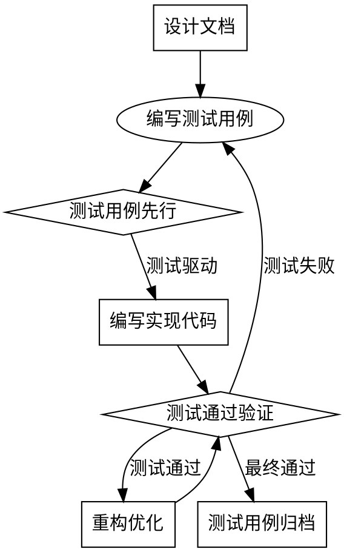

# Document-Test - 测试文档管理独立技能

> 顶层设计是质量保障的基石，抓手是标准化测试模板，闭环是从需求到验证的完整测试流程。

**⚠️ 测试不充分就是质量隐患。覆盖要全面，用例要可测。**

## 概述

`document-test` 是松立研发文档管理系统的测试文档模块，负责测试用例设计、测试计划编制和测试报告生成。作为软件开发质量保障的关键环节，确保测试文档的标准化和完整性。

## ⛳ 初始化配置前置检查（强制）

**执行任何 `/document-test` 子命令前，必须先完成初始化检查**。未初始化时立即中止当前操作，引导用户执行 `/document-init`，严禁绕过。

### 必检项

- [ ] 当前处于 Git 仓库（`git rev-parse --show-toplevel` 可成功）
- [ ] `.sonli-spec-doc/config.yaml` 存在
- [ ] `storage.mode == git_repo`
- [ ] `directories.active_plan` 已设置（非空）
- [ ] `.sonli-spec-doc/<active_plan>/test/{testcases,test-report}/` 目录存在

### 检查脚本（AI 执行此逻辑）

```bash
REPO_ROOT=$(git rev-parse --show-toplevel 2>/dev/null) || { echo "❌ 当前不在 Git 仓库"; exit 1; }
cd "$REPO_ROOT"

CONFIG=".sonli-spec-doc/config.yaml"
[ -f "$CONFIG" ] || { echo "❌ 未检测到 $CONFIG，请先执行 /document-init '<月度计划名>'"; exit 1; }

ACTIVE_PLAN=$(grep -E '^[[:space:]]*active_plan:' "$CONFIG" | head -1 | cut -d: -f2- | cut -d'#' -f1 | tr -d '"' | tr -d "'" | xargs)
[ -n "$ACTIVE_PLAN" ] || { echo "❌ active_plan 未设置，请执行 /document-init plan '<月度计划名>'"; exit 1; }

for sub in testcases test-report; do
  [ -d ".sonli-spec-doc/$ACTIVE_PLAN/test/$sub" ] || { echo "❌ 测试目录缺失：.sonli-spec-doc/$ACTIVE_PLAN/test/$sub，请重新执行 /document-init '$ACTIVE_PLAN'"; exit 1; }
done

echo "✅ Test 初始化配置检查通过（活跃计划：$ACTIVE_PLAN）"
```

### 未通过时的统一响应

```
⚠️ 未检测到文档初始化配置（或活跃月度计划未设置）
原因：<config.yaml 缺失 | active_plan 未配置 | test 子目录缺失>
建议：
  1. /document-init '2026年4月月度计划'   ← 首次初始化
  2. /document-init plan '2026年4月月度计划' ← 仅切换活跃计划
完成后请重新执行本命令。
```

### 理性化防护

| 漏洞 | 防护 |
|------|------|
| "先写测试用例，事后再初始化" | 禁止：无 active_plan 时测试用例无法归档月度计划 |
| "手动创建 config.yaml 绕过检查" | 禁止：必须通过 `/document-init` 保证目录结构标准化和配置一致性 |
| "测试报告丢到项目根目录" | 禁止：必须进 `test/test-report`，便于回溯验收链 |

## 与test-driven-development深度集成

### TDD核心原则在测试设计中的应用

**⚠️ 红牌警告**: 没有测试的设计都是技术债。TDD不是选项，是必须。


```dot
digraph tdd_integration {
    "设计文档" [shape=box];
    "编写测试用例" [shape=ellipse];
    "测试用例先行" [shape=diamond];
    "编写实现代码" [shape=box];
    "测试通过验证" [shape=diamond];
    "重构优化" [shape=box];
    "测试用例归档" [shape=box];

    "设计文档" -> "编写测试用例";
    "编写测试用例" -> "测试用例先行";
    "测试用例先行" -> "编写实现代码" [label="测试驱动"];
    "编写实现代码" -> "测试通过验证";
    "测试通过验证" -> "重构优化" [label="测试通过"];
    "测试通过验证" -> "编写测试用例" [label="测试失败"];
    "重构优化" -> "测试通过验证";
    "测试通过验证" -> "测试用例归档" [label="最终通过"];
}
```

**强制TDD流程**: 
1. **测试先行**: 所有功能必须先从测试用例开始
2. **用例可执行**: 测试用例必须可执行，不能是描述性文档
3. **失败验证**: 新功能开发前必须看到测试失败
4. **通过验证**: 实现后必须看到测试通过
5. **重构安全**: 重构必须在测试保护下进行

## 核心功能

### 1. 测试用例设计
- **格式**: `/document-test 生成 "测试场景描述"`
- **功能**: 基于功能需求生成详细的测试用例
- **模板**: 使用标准化测试用例模板

### 2. 测试计划编制  
- **格式**: `/document-test 计划 "项目名称"`
- **功能**: 创建完整的测试计划文档
- **内容**: 测试范围、资源、时间、风险等

### 3. 测试报告生成
- **格式**: `/document-test 报告 "测试执行结果"`
- **功能**: 生成测试执行报告
- **数据**: 测试通过率、缺陷统计、风险评估

### 4. 文档提交管理
- **格式**: `/document-test 提交`
- **功能**: 将测试文档写入 `.sonli-spec-doc/<活跃计划>/test/` 对应子目录
- **版本关联**: 通过文件命名和目录结构关联测试文档与设计文档版本

## 使用说明

### 连字符格式（推荐）
```bash
# 生成测试用例
/document-test 生成 "用户登录功能测试"

# 创建测试计划
/document-test 计划 "电商平台项目"

# 生成测试报告
/document-test 报告 "用户模块测试结果"

# 提交文档
/document-test 提交
```

### 空格格式（兼容）
```bash
/document test 生成 "用户登录功能测试"
/document test 计划 "电商平台项目"
/document test 报告 "用户模块测试结果"
```

## 测试用例模板

### 标准测试用例结构
```markdown
# 测试用例: {测试场景}

## 基本信息
- **用例ID**: TC-001
- **测试模块**: {模块名称}
- **优先级**: P0/P1/P2/P3

## 前置条件
1. {条件1}
2. {条件2}

## 测试步骤
| 步骤 | 操作 | 预期结果 |
|------|------|----------|
| 1 | {操作1} | {预期结果1} |
| 2 | {操作2} | {预期结果2} |
| 3 | {操作3} | {预期结果3} |

## 测试数据
- 输入数据: {数据描述}
- 环境配置: {环境要求}

## 测试结果
- **执行状态**: 通过/失败/阻塞
- **实际结果**: {实际执行结果}
- **缺陷ID**: {如有缺陷}
```

### 测试计划模板
```markdown
# 测试计划: {项目名称}

## 1. 测试目标
- {目标1}
- {目标2}

## 2. 测试范围
- **功能测试**: {范围描述}
- **性能测试**: {范围描述}
- **安全测试**: {范围描述}
- **兼容性测试**: {范围描述}

## 3. 测试策略
- **测试类型**: {测试类型}
- **测试方法**: {测试方法}
- **测试工具**: {测试工具}

## 4. 测试环境
- **硬件环境**: {硬件要求}
- **软件环境**: {软件要求}
- **网络环境**: {网络要求}

## 5. 测试资源
- **人员配置**: {人员安排}
- **时间计划**: {时间安排}
- **工具准备**: {工具清单}

## 6. 风险评估
- **风险项**: {风险描述}
- **影响程度**: 高/中/低
- **应对措施**: {应对方案}
```

## 集成功能

### 与Superpowers技能深度集成

**⚠️ 技能集成不是可选项，是质量保障的必须项。**

#### 1. 与test-driven-development强制集成
- **测试先行强制**: 所有功能开发必须从测试用例开始
- **失败验证强制**: 新功能开发前必须看到测试失败
- **通过验证强制**: 实现后必须看到测试通过
- **重构保护强制**: 重构必须在测试保护下进行

#### 2. 与systematic-debugging缺陷预防集成
- **测试设计防错**: 在测试设计阶段应用debugging方法论
- **失败根因分析**: 测试失败时进行系统化根因分析
- **缺陷模式识别**: 识别重复出现的缺陷模式并优化测试

#### 3. 与qa技能质量评估集成
- **测试有效性评估**: 评估测试用例的有效性和覆盖度
- **质量趋势分析**: 分析测试通过率和缺陷趋势
- **改进建议生成**: 基于测试结果生成质量改进建议

### 文档写入集成
```bash
# 生成测试用例后写入工作区
TEST_PATH=".sonli-spec-doc/$(get_active_plan)/test"

# AI 将测试用例写入 $TEST_PATH/testcases/<功能名>.md
# AI 将测试报告写入 $TEST_PATH/test-report/<功能名>.md
```

## 最佳实践

**没有完整性的测试就是质量隐患。3.25必须对齐，颗粒度要细。**

- [ ] **需求覆盖检查**: 测试用例覆盖所有PRD功能需求
- [ ] **边界条件覆盖**: 覆盖正常、边界、异常场景
- [ ] **数据组合覆盖**: 覆盖关键数据组合场景
- [ ] **路径覆盖检查**: 覆盖主要执行路径
- [ ] **性能覆盖检查**: 包含性能测试用例
- [ ] **安全覆盖检查**: 包含安全测试用例
- [ ] **兼容性覆盖**: 包含兼容性测试用例
- [ ] **恢复性检查**: 包含系统恢复测试用例
- [ ] **可维护性检查**: 测试用例可维护、可扩展
- [ ] **可执行性检查**: 测试用例可实际执行

**任何一项缺失都必须补充，不能以"后续补充"为借口。测试不全是质量隐患。**

## 常见的理性化漏洞及防护

| 漏洞 | 防护措施 |
|------|----------|
| "测试用例太多，先写关键的吧" | **强制全面**: 关键用例必须100%覆盖 |
| "这个功能简单，不用写测试" | **强制测试**: 简单功能也要有基本测试 |
| "时间不够，测试后面补" | **强制前置**: 测试必须前置，不能后补 |
| "边界条件太复杂，跳过吧" | **强制边界**: 边界条件必须测试 |
| "性能测试太耗时，先不做" | **强制性能**: 关键性能指标必须测试 |

**理性化的本质是质量妥协。今天妥协测试，明天就出问题。**


### 常见问题
1. **测试用例生成不完整**
   - 检查需求描述是否完整
   - 确认测试场景是否清晰

2. **文档提交失败**
   - 检查 git 状态：`git status`
   - 确认目标路径已创建：`ls .sonli-spec-doc/<活跃计划>/test/`
   - 检查 git 权限和远程配置：`git remote -v`

3. **模板无法识别**
   - 检查模板文件是否存在
   - 确认格式是否符合要求

### 调试命令
```bash
# 检查测试文档目录
ls -la .sonli-spec-doc/$(cat .sonli-spec-doc/config.yaml | grep active_plan | awk '{print $2}')/test/

# 检查 git 状态
git status

# 查看最近提交
git log --oneline -5
```

---
**版本**: 1.0.0  
**状态**: 就绪  
**依赖**: Git、superpowers 技能集