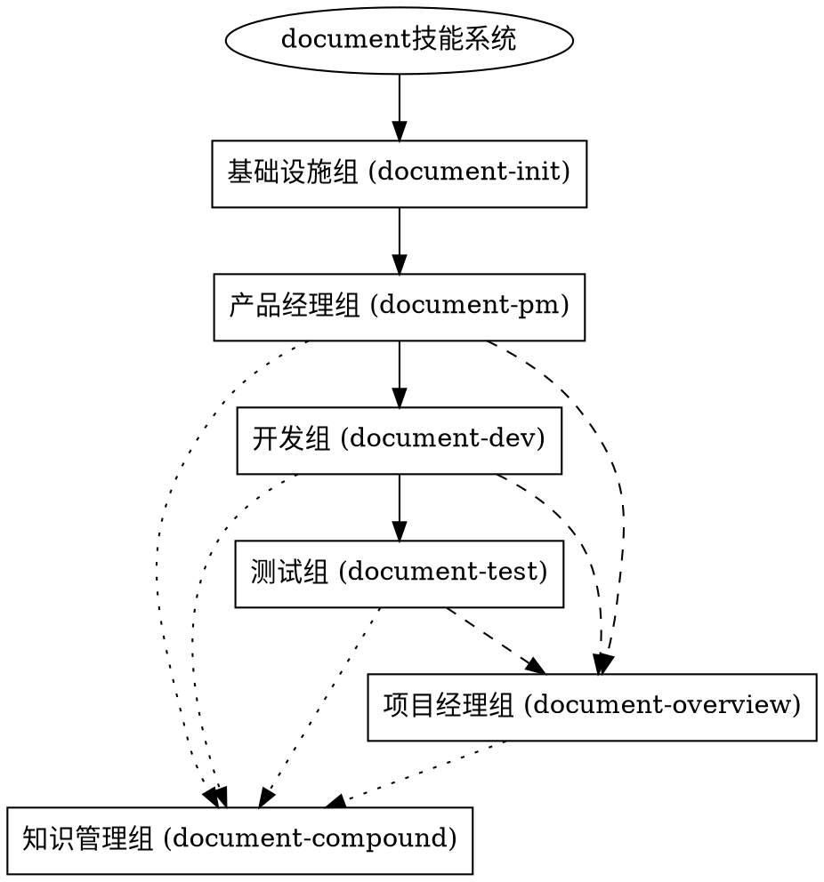

# Document - 文档管理系统协同框架与路由层

> **顶层设计**：建立技能协同框架，拉通对齐各独立技能
> **抓手**：统一配置管理、状态同步、完整性检查
> **闭环**：从路由到独立技能的完整协同机制
> **owner意识**：明确各技能owner，责任到人

**⚠️ 阿里文化视角**：没有协同就是资源浪费，没有owner就是责任推诿。必须建立清晰的协同框架和owner机制。

## 概述

`document` 系统已从单一综合技能拆分为6个独立技能。本技能现在承担双重职责：
1. **路由层**：保持向后兼容，支持空格格式命令
2. **协同框架**：建立技能间协同机制，确保各技能高效协作

## 协同框架设计

### 1. 统一配置管理
```json
// .sonli-spec-doc/config.json
{
  "document-system": {
    "version": "2.0",
    "config": {
      "gitlab-repo": "https://gitlab.com/团队/wit-parking-wiki",
      "directory-structure": "standardized",
      "integrity-checks": "mandatory"
    },
    "skills": {
      "document-init": { 
        "owner": "基础设施", 
        "responsibility": "GitLab配置、目录结构",
        "status": "ready",
        "last-executed": "2026-04-24T10:30:00Z"
      },
      "document-pm": { 
        "owner": "产品经理", 
        "responsibility": "PRD质量、需求澄清",
        "depends-on": ["document-init"],
        "status": "waiting"
      },
      "document-dev": { 
        "owner": "开发组", 
        "responsibility": "设计文档、技术方案", 
        "depends-on": ["document-pm"],
        "status": "waiting"
      },
      "document-test": { 
        "owner": "测试组", 
        "responsibility": "测试用例、质量保证",
        "depends-on": ["document-dev"],
        "status": "waiting"
      },
      "document-overview": { 
        "owner": "项目经理", 
        "responsibility": "进度报告、团队协调",
        "depends-on": ["document-pm", "document-dev", "document-test"],
        "status": "waiting"
      },
      "document-compound": { 
        "owner": "知识管理", 
        "responsibility": "经验总结、知识沉淀",
        "depends-on": ["document-pm", "document-dev", "document-test", "document-overview"],
        "status": "waiting"
      }
    }
  }
}
```

### 2. 状态同步机制
- **配置状态同步**：所有技能共享同一配置
- **执行状态同步**：记录每个技能的执行状态
- **依赖状态检查**：执行前检查依赖技能状态
- **完整性状态**：记录完整性检查结果

### 3. 完整性检查分级体系
**没有完整性检查就是技术债，必须强制执行：**

#### Level 1：基础配置检查（每个技能执行前）
- [ ] GitLab CLI可用性：`glab --version`
- [ ] 认证状态：`glab auth status`
- [ ] 配置完整性：检查`.sonli-spec-doc/config.json`
- [ ] 依赖技能状态：检查依赖技能是否就绪

#### Level 2：文档结构检查（文档生成时）
- [ ] 模板完整性：所有必填章节存在
- [ ] 格式规范性：符合团队文档规范
- [ ] 内容完整性：无缺失的关键信息
- [ ] 术语一致性：术语使用一致

#### Level 3：内容质量检查（文档完成后）
- [ ] 逻辑连贯性：内容逻辑清晰
- [ ] 可读性评估：易于理解和执行
- [ ] 可行性评估：技术方案可行
- [ ] 风险评估：识别和评估风险

#### Level 4：协同一致性检查（多文档间）
- [ ] 版本一致性：相关文档版本匹配
- [ ] 内容一致性：跨文档内容不冲突
- [ ] 状态一致性：各技能状态协调
- [ ] 进度一致性：进度报告与实际匹配

### 4. Owner责任机制
**没有owner就是责任推诿，必须明确到人：**



### 6. 理性化漏洞防护机制

**阿里文化视角：理性化是技术债的根源，必须从源头防范。**

#### 禁止的理性化行为及防护措施

| 理性化行为 | 阿里文化视角 | 防护措施 |
|------------|--------------|----------|
| **"差不多就行"** | 颗粒度不够细，缺乏owner意识 | **强制完成**：所有检查项必须100%完成，没有"差不多"选项 |
| **"后面再补"** | 闭环不完整，责任推诿 | **立即完成**：现在不做就是永远不做，必须当场完成 |
| **"不是我的问题"** | owner意识缺失，责任不清 | **明确owner**：每个问题都有明确owner，责任到人 |
| **"先跳过吧"** | 底层逻辑缺失，缺乏执行力 | **禁止跳过**：关键检查不能跳过，没有例外 |
| **"感觉可以了"** | 缺乏量化标准，凭感觉做事 | **量化检查**：所有检查都有量化标准，不靠感觉 |

#### 完整性检查强制执行规则

**底层逻辑**：完整性是质量的底线，不能妥协。

1. **Level 1检查失败** → **立即修复**：不能继续执行，必须修复后才能继续
2. **Level 2检查失败** → **重新生成**：文档结构问题，必须重新生成
3. **Level 3检查失败** → **质量改进**：内容质量问题，必须改进后才能接受
4. **Level 4检查失败** → **协同修复**：协同一致性问题，必须多技能协同修复

**3.25对齐要求**：每个检查项都必须有明确的验收标准和owner。

#### 状态同步强制要求

**因为信任所以简单，但必须先验证信任：**

1. **配置状态必须实时同步**：所有技能共享最新配置
2. **执行状态必须准确记录**：每个技能的执行状态准确无误
3. **依赖状态必须严格检查**：依赖未就绪的技能不能执行
4. **完整性状态必须强制验证**：完整性检查结果必须验证和记录

**没有状态同步就是信息孤岛，必须拉通对齐。**

### 7. 性能优化策略

**顶层设计**：通过缓存、懒加载和直接调用优化性能，减少路由开销。

#### 7.1 缓存机制
```json
{
  "caching-strategy": {
    "config-cache": {
      "ttl": "300s",  // 5分钟配置缓存
      "scope": "global",
      "invalidation": "on-config-change"
    },
    "template-cache": {
      "ttl": "3600s", // 1小时模板缓存
      "scope": "session",
      "invalidation": "manual"
    },
    "status-cache": {
      "ttl": "60s",   // 1分钟状态缓存
      "scope": "global",
      "invalidation": "real-time"
    }
  }
}
```

#### 7.2 懒加载策略
1. **配置懒加载**：只在需要时加载配置，避免启动开销
2. **模板懒加载**：文档生成时才加载对应模板
3. **验证懒加载**：分阶段执行验证，避免一次性开销
4. **依赖懒加载**：只在执行时检查依赖，避免预检查开销

#### 7.3 路由优化
1. **直接调用优先**：强烈推荐使用连字符格式直接调用
2. **路由缓存**：路由映射缓存，减少解析开销
3. **错误缓存**：常见错误缓存，加快错误恢复
4. **连接复用**：复用GitLab连接，避免重复建立连接

#### 7.4 性能指标目标
| 指标 | 目标值 | 当前状态 | Owner |
|------|--------|----------|-------|
| 路由响应时间 | < 50ms | 待测量 | 基础设施组 |
| 直接调用时间 | < 30ms | 待测量 | 各技能owner |
| 缓存命中率 | > 90% | 待测量 | 基础设施组 |
| 内存使用 | < 100MB | 待测量 | 基础设施组 |

**性能优化是持续过程，必须建立监控和持续改进机制。**

| 原命令格式 | 新命令格式（推荐） | 目标独立技能 |
|------------|-------------------|-------------|
| `/document init <url>` | `/document-init <url>` | `document-init` |
| `/document pm <操作>` | `/document-pm <操作>` | `document-pm` |
| `/document dev <操作>` | `/document-dev <操作>` | `document-dev` |
| `/document test <操作>` | `/document-test <操作>` | `document-test` |
| `/document overview <操作>` | `/document-overview <操作>` | `document-overview` |
| `/document compound <操作>` | `/document-compound <操作>` | `document-compound` |

## 使用建议

### 推荐使用方式
```bash
# 连字符格式（直接调用独立技能）
/document-init https://gitlab.com/团队/wit-parking-wiki
/document-pm 生成 "需求描述"
/document-dev 生成 "功能设计"
/document-test 生成 "测试用例"
/document-overview 生成
/document-compound 生成
```

### 兼容使用方式
```bash
# 空格格式（通过本路由层转发）
/document init https://gitlab.com/团队/wit-parking-wiki
/document pm 生成 "需求描述"
/document dev 生成 "功能设计"
/document test 生成 "测试用例"
/document overview 生成
```

## 协同路由逻辑

### 空格格式命令处理流程
当接收到空格格式命令（如`/document init <url>`）时，本技能执行以下协同路由步骤：

#### 阶段1：协同框架检查
1. **框架完整性检查**：检查协同框架配置是否完整
2. **配置状态同步**：同步最新配置状态
3. **技能状态验证**：验证目标技能状态是否正常
4. **依赖关系检查**：检查依赖技能是否已就绪

#### 阶段2：路由执行
5. **命令解析**：提取子命令和参数
6. **目标匹配**：根据映射表找到目标独立技能
7. **完整性预检**：执行Level 1基础配置检查
8. **技能调用**：调用对应的独立技能（传递协同上下文）

#### 阶段3：协同处理
9. **执行监控**：监控技能执行过程和完整性检查
10. **状态更新**：更新技能执行状态和配置
11. **相关通知**：通知依赖此技能的其他技能
12. **结果返回**：返回执行结果和协同状态

#### 阶段4：性能优化
13. **性能提示**：显示建议使用连字符格式直接调用的提示
14. **缓存更新**：更新相关缓存以提高后续性能
15. **统计收集**：收集性能指标和协同效果数据

### 连字符格式直接调用
当使用连字符格式（如`/document-init <url>`）时，独立技能将：
1. **检查协同配置**：读取共享配置
2. **执行完整性检查**：按照分级体系执行检查
3. **更新协同状态**：执行后更新状态
4. **通知相关方**：通知其他相关技能

**性能建议**：推荐使用连字符格式直接调用，避免路由层开销，获得最佳性能。

## 迁移状态

### 已完成拆分
- ✅ `document-init`：GitLab Wiki仓库初始化（已优化CSO描述和完整性检查）
- ✅ `document-pm`：PRD文档管理（已优化智能降级策略和完整性检查）
- ✅ `document-dev`：功能设计文档管理（已优化工程流程集成和完整性检查）
- ✅ `document-test`：测试用例文档管理（已优化TDD集成和完整性检查）
- ✅ `document-overview`：项目概览管理（已优化进度播报机制和完整性检查）
- ✅ `document-compound`：开发经验总结（已优化经验沉淀闭环和完整性检查）

### 待完善功能
- 🔄 技能间通信自动化优化
- 🔄 性能监控和告警集成
- 🔄 大规模项目支持优化
- 🔄 多团队协同支持

## 故障排除

### 常见问题

1. **"技能未找到"错误**
   - 原因：独立技能目录不存在或配置错误
   - 解决：检查独立技能目录是否正确创建

2. **路由失败**
   - 原因：子命令无法映射到独立技能
   - 解决：使用连字符格式直接调用

3. **性能警告**
   - 原因：路由层增加额外开销
   - 解决：按照提示使用连字符格式

### 调试信息
```bash
# 查看路由详情
/document --debug init <url>

# 测试所有路由
/document test-routes

# 查看技能状态
/document status
```

## 向后兼容保证

### 兼容性承诺
1. **功能兼容**：所有原功能在独立技能中完整实现
2. **接口兼容**：命令格式和参数保持兼容
3. **数据兼容**：配置文件和数据格式保持兼容
4. **性能兼容**：独立技能性能不低于原综合技能

### 迁移时间线
- **阶段一**（已完成）：创建独立技能骨架
- **阶段二**（进行中）：完善独立技能功能
- **阶段三**（计划中）：性能优化和测试
- **阶段四**（计划中）：原综合技能归档

## 独立技能详情

### document-init
- **职责**：GitLab Wiki仓库初始化与配置管理
- **命令**：`/document-init <gitlab-wiki-url>`
- **状态**：✅ 已优化（强化CSO描述、完整性检查、理性化防护）
- **关键优化**：阿里文化植入、配置完整性检查表、理性化漏洞防护

### document-pm  
- **职责**：PRD文档生成、上传与版本管理
- **命令**：`/document-pm 生成|上传|版本|评估`
- **状态**：✅ 已优化（智能降级策略、完整性检查、工程集成）
- **关键优化**：智能降级流程图、PRD完整性检查表、依赖技能集成

### document-dev
- **职责**：功能设计文档生成与架构设计
- **命令**：`/document-dev 生成|上传|设计|评审`
- **状态**：✅ 已优化（工程流程集成、完整性检查、superpowers集成）
- **关键优化**：TDD集成、设计完整性检查表、与systematic-debugging深度集成

### document-test
- **职责**：测试用例设计与测试报告生成
- **命令**：`/document-test 生成|上传|报告|计划`
- **状态**：✅ 已优化（TDD强制集成、完整性检查、技能集成）
- **关键优化**：TDD强制流程图、测试完整性检查表、与test-driven-development深度集成

### document-overview
- **职责**：项目概览、进度报告与播报
- **命令**：`/document-overview 生成|更新|播报|健康度`
- **状态**：✅ 已优化（进度播报机制、完整性检查、自动化收集）
- **关键优化**：钉钉播报模板、进度完整性检查表、自动化状态收集

### document-compound
- **职责**：开发经验总结与知识沉淀
- **命令**：`/document-compound 生成|上传|分析|总结`
- **状态**：✅ 已优化（经验沉淀闭环、完整性检查、知识传承）
- **关键优化**：知识升华循环、经验完整性检查表、知识传承机制
- **命令**：`/document-compound 生成|上传|分析`
- **状态**：🔄 开发中

## 性能对比

### 路由层 vs 直接调用
| 指标 | 路由层（空格格式） | 直接调用（连字符格式） |
|------|-------------------|----------------------|
| 响应时间 | +10-20ms（路由开销） | 最优 |
| 内存占用 | 路由层+目标技能 | 仅目标技能 |
| 错误处理 | 两层错误处理 | 单层错误处理 |
| 维护性 | 需维护路由逻辑 | 独立维护 |

### 推荐实践
- **新项目**：直接使用连字符格式调用独立技能
- **现有项目**：可继续使用空格格式，逐步迁移
- **自动化脚本**：建议更新为连字符格式

## 贡献指南

### 技能开发
如需贡献独立技能开发，请：
1. 选择目标独立技能
2. 阅读对应技能的开发文档
3. 遵循统一接口规范
4. 提交Pull Request

### 问题反馈
发现路由问题或兼容性问题时：
1. 创建GitLab Issue
2. 描述问题和复现步骤
3. 提供当前环境信息
4. 标记为"兼容性问题"

## 路线图

### Q2 2026
- [ ] 完善所有独立技能详细功能
- [ ] 完成单元测试覆盖
- [ ] 优化技能间通信机制
- [ ] 发布稳定版独立技能

### Q3 2026  
- [ ] 添加技能性能监控
- [ ] 实现技能热加载
- [ ] 支持技能插件机制
- [ ] 发布v2.0版本

### Q4 2026
- [ ] 归档原综合技能
- [ ] 发布迁移完成公告
- [ ] 提供长期支持承诺

---

> **迁移提示**：为获得最佳性能和体验，建议使用连字符格式直接调用独立技能。路由层将在一段时间后逐步淘汰。

**版本**：2.0.0-路由层  
**状态**：兼容性支持  
**计划淘汰时间**：2026-12-31

## 核心功能

### 1. 仓库初始化：`/document-init <gitlab-wiki-url>`
- 关联团队的GitLab Wiki仓库
- 初始化本地文档目录结构
- 配置GitLab CLI认证信息
- **支持连字符格式**：与`/document init`完全兼容

### 2. PRD文档管理：`/document-pm [生成|上传] <文档内容>`
- **智能生成产品需求文档（PRD）**：驱动辅助技能澄清需求
- **可选技能集成**：
  - `/brainstorming`：需求澄清与探索
  - `/office-hours`：产品经理视角review
  - `gstack`：技术架构评估（如可用）
- **自适应模板**：基于澄清结果生成更精准的PRD
- **统一目录结构**：上传到GitLab Wiki的`pm/prd/`目录
- **兼容原有格式**：仍支持`/document pm [生成|上传]`

### 3. 功能设计文档管理：`/document-dev [生成|上传] <文档内容>`
- 生成功能设计Spec文档
- **使用内置功能设计模板**，支持详细设计
- 支持plans、tasks、test report、review report等子文档
- 上传到GitLab Wiki的`dev/`相关目录
- **备注**：设计评审可使用现有代码审查技能
- **兼容原有格式**：仍支持`/document dev [生成|上传]`

### 4. 测试用例文档管理：`/document-test [生成|上传] <文档内容>`
- 生成测试用例文档
- **使用内置测试用例模板**，支持完整测试设计
- 支持testcases、test report等文档
- 上传到GitLab Wiki的`test/`目录
- **备注**：可使用`superpowers:test-driven-development`技能辅助
- **兼容原有格式**：仍支持`/document test [生成|上传]`

### 5. 项目概览管理：`/document-overview [生成|更新]`
- 生成项目进度报告（overview）
- 自动汇总各模块进度状态
- 生成钉钉播报格式
- 更新到GitLab Wiki根目录的`overview.md`
- **兼容原有格式**：仍支持`/document overview [生成|更新]`

### 6. 开发经验总结：`/document-compound [生成|上传]`
- **智能分析本次开发周期**：自动收集PRD、设计、测试文档
- **经验总结生成**：
  - 成功经验与最佳实践
  - 失败教训与避坑指南
  - 可复用模式与模板
  - 团队知识沉淀
- **结构化输出**：生成标准化的经验总结文档
- **自动上传**：上传到GitLab Wiki的`knowledge-base/compound/`目录

## 目录结构规范

```
wit-parking-wiki/              # GitLab Wiki项目协作文档目录
├── pm/
│   └── prd/                   # 产品需求文档（优化后简化路径）
├── dev/
│   ├── plans/                # 需求拆解
│   ├── tasks/                # 任务分配
│   ├── test report/          # 测试验收报告
│   └── review report/        # 代码审查报告
├── test/
│   ├── testcases/            # 测试用例
│   └── test report/          # 测试验收报告
├── knowledge-base/
│   └── compound/             # 开发经验总结（新增）
├── DESIGN.md                 # UI/UX设计规范
├── overview.md               # 项目进度报告（每天钉钉播报）
└── CHANGELOG.md             # 项目变更日志
```

## 使用说明

### 命令格式说明
本技能支持两种命令格式，确保最大兼容性：

1. **连字符格式**（推荐）：`/document-<子命令>`
   - `/document-init` - 仓库初始化
   - `/document-pm` - PRD文档管理  
   - `/document-dev` - 功能设计文档管理
   - `/document-test` - 测试用例文档管理
   - `/document-overview` - 项目概览管理
   - `/document-compound` - 开发经验总结

2. **空格格式**（兼容原有）：`/document <子命令>`
   - `/document init` - 仓库初始化
   - `/document pm` - PRD文档管理
   - `/document dev` - 功能设计文档管理
   - `/document test` - 测试用例文档管理
   - `/document overview` - 项目概览管理

**技术说明**：Claude Code按目录名匹配技能。为支持连字符格式，已创建符号链接：
- `document-init` → `document`
- `document-pm` → `document`
- 等等...

### 阶段一：初始化设置
1. **安装GitLab CLI**：`brew install glab` 或参考官方文档
2. **配置认证**：`glab auth login` 配置GitLab访问权限
3. **初始化文档库**：
   - 连字符格式：`/document-init https://gitlab.com/团队/wit-parking-wiki`
   - 空格格式：`/document init https://gitlab.com/团队/wit-parking-wiki`

### 阶段二：智能PRD开发
1. **需求澄清（可选）**：
   - 基本模式：`/document-pm 生成 "需求描述"`
   - 智能模式：询问是否需要`/brainstorming`、`/office-hours`、`gstack`等技能辅助
2. **智能生成PRD**：
   - 根据澄清结果生成精准PRD
   - 补充背景、目标、验收标准等
3. **上传PRD**：`/document-pm 上传`（上传到`pm/prd/`目录）

### 阶段三：功能设计
1. **需求拆解**：`/document-dev 生成 "功能描述"`
2. **详细设计**：创建plans、tasks、review report等文档
3. **上传设计文档**：`/document-dev 上传`

### 阶段四：测试设计
1. **测试用例设计**：`/document-test 生成 "测试场景"`
2. **完善用例**：补充前置条件、测试步骤、预期结果
3. **上传测试文档**：`/document-test 上传`

### 阶段五：项目跟踪
1. **生成进度报告**：`/document-overview 生成`
2. **每日更新**：根据实际进度更新overview
3. **钉钉播报**：自动生成钉钉群播报格式

### 阶段六：经验总结（新增）
1. **自动收集文档**：`/document-compound 生成`
   - 分析本次开发周期的所有文档
   - 提取成功经验与失败教训
2. **生成总结报告**：
   - 结构化经验总结
   - 可复用模式识别
   - 团队知识沉淀
3. **上传总结文档**：`/document-compound 上传`（上传到`knowledge-base/compound/`）

## 文档模板系统

### PRD模板结构
```markdown
# 产品需求文档

## 1. 需求背景
- 业务背景
- 问题描述
- 影响范围

## 2. 目标与范围
- 核心目标
- 成功标准
- 验收条件

## 3. 功能需求
- 功能点1
- 功能点2

## 4. 非功能需求
- 性能要求
- 安全要求
- 兼容性要求

## 5. 交付计划
- 关键里程碑
- 资源需求
- 风险管控
```

### 功能设计模板
```markdown
# 功能设计文档

## 1. 设计目标
- 解决什么问题
- 达到什么效果

## 2. 系统架构
- 模块划分
- 数据流图
- 接口设计

## 3. 详细设计
- 关键算法
- 数据结构
- 状态流转

## 4. 接口规范
- API设计
- 数据格式
- 错误处理

## 5. 部署方案
- 环境要求
- 部署步骤
- 监控指标
```

### 测试用例模板
```markdown
# 测试用例文档

## 测试场景
- 场景描述
- 测试目标

## 测试用例
### 用例1：功能验证
- 前置条件
- 测试步骤
- 预期结果
- 实际结果

### 用例2：边界测试
- 前置条件
- 测试步骤
- 预期结果
- 实际结果
```

### Compound模板
```markdown
# 开发经验总结报告

## 📊 项目概览
- **项目名称**：{项目名称}
- **总结周期**：{开始日期} 至 {结束日期}
- **负责人**：{负责人}
- **团队规模**：{团队成员数量}

## 🏆 成功经验

### 1. 流程优化
- **有效实践**：{具体实践描述}
- **效果评估**：{效率提升、质量改进等}
- **可复用性**：⭐️⭐️⭐️⭐️⭐️（5星评分）

### 2. 技术方案
- **创新点**：{技术创新的描述}
- **实现效果**：{性能、稳定性等提升}
- **适用范围**：{适用场景说明}

### 3. 团队协作
- **协作模式**：{团队协作方式}
- **沟通效率**：{沟通改进点}
- **跨团队协同**：{跨团队合作经验}

## ⚠️ 失败教训

### 1. 遇到的问题
- **问题描述**：{具体问题}
- **根本原因**：{问题根源分析}
- **影响范围**：{对项目的影响}

### 2. 解决方案
- **临时应对**：{临时解决方案}
- **根本解决**：{根本解决方案}
- **预防措施**：{未来预防方案}

### 3. 改进建议
- **流程改进**：{流程优化建议}
- **工具改进**：{工具或系统改进}
- **能力提升**：{团队能力建设}

## 🔄 可复用模式

### 1. 文档模板
- **优秀模板**：{模板名称与特点}
- **使用场景**：{适用场景}
- **效果验证**：{使用效果}

### 2. 代码模式
- **设计模式**：{设计模式名称}
- **实现方案**：{具体实现}
- **性能表现**：{性能数据}

### 3. 工作流模式
- **流程设计**：{工作流程}
- **效率指标**：{效率数据}
- **扩展性**：{可扩展性评估}

## 📈 量化指标

| 指标类别 | 优化前 | 优化后 | 提升幅度 |
|----------|--------|--------|----------|
| 开发效率 | {数据} | {数据} | {百分比} |
| 代码质量 | {数据} | {数据} | {百分比} |
| 文档完整度 | {数据} | {数据} | {百分比} |
| 团队满意度 | {数据} | {数据} | {百分比} |

## 🎯 下一步行动计划

### 短期（1个月内）
1. {行动计划1}
2. {行动计划2}

### 中期（1-3个月）
1. {行动计划1}
2. {行动计划2}

### 长期（3个月以上）
1. {行动计划1}
2. {行动计划2}

## 📚 知识沉淀

### 已归档文档
- {文档1}：{链接}
- {文档2}：{链接}

### 培训材料
- {培训主题}：{材料链接}
- {最佳实践}：{文档链接}

### 团队分享
- {分享主题}：{分享记录}
- {讨论要点}：{关键讨论}
```

## GitLab集成

### GitLab CLI命令封装
```bash
# 上传文档到Wiki
glab repo wiki create "文档路径" --content "文档内容"

# 更新文档
glab repo wiki update "文档路径" --content "新内容"

# 查看Wiki
glab repo wiki list
```

### 认证管理
- 支持个人访问令牌（PAT）认证
- 支持OAuth2认证
- 支持项目级权限控制

## 容错机制

### 依赖检查与处理
1. **GitLab CLI检查**：使用前自动检查`glab`命令是否可用，如不可用提示安装
2. **模板备用机制**：所有文档生成均使用内置模板，不依赖外部技能
3. **可选技能集成**：
   - **需求澄清**：可使用`superpowers:brainstorming`替代
   - **架构评估**：可使用`gstack`如可用
   - **PM视角review**：可使用`/office-hours`如可用
   - **设计评审**：可使用现有代码审查技能
   - **测试驱动**：可使用`superpowers:test-driven-development`
4. **智能降级策略**：
   - 如辅助技能不可用，自动降级到基础模板
   - 保持核心功能可用性
   - 提供明确的降级提示

### GitLab连接失败处理
1. **网络问题**：本地保存文档，稍后重试
2. **权限问题**：提示用户检查认证配置
3. **仓库不存在**：引导用户创建Wiki仓库

## 最佳实践

### 文档质量检查
- **完整性检查**：必须包含所有必填章节
- **一致性检查**：术语、格式统一
- **可读性检查**：结构清晰，逻辑通顺

### 版本管理
- **文档版本号**：v1.0.0格式
- **变更记录**：记录每次重大修改
- **备份机制**：本地备份重要文档

### 团队协作
- **权限分配**：按角色设置访问权限
- **评审流程**：文档必须经过评审
- **知识沉淀**：优秀文档模板入库

## 故障排除

### 常见问题
1. **GitLab CLI认证失败**
   - 检查`glab auth status`
   - 重新认证：`glab auth login`

2. **文档上传失败**
   - 检查网络连接
   - 检查仓库权限
   - 查看错误日志

3. **技能调用失败**
   - 检查依赖技能是否存在
   - 使用内置模板替代

4. **新格式兼容问题**
   - `/document-init`与`/document init`同时支持
   - 如连字符格式不工作，尝试空格格式
   - 检查技能加载配置

### 调试命令
```bash
# 检查GitLab连接
glab auth status

# 查看本地文档
ls -la .sonli-spec-doc/

# 查看上传历史
cat .sonli-spec-doc/upload.log
```

## 扩展功能

### 插件系统
- **模板插件**：自定义文档模板
- **导出插件**：支持Word、PDF导出
- **分析插件**：文档质量分析

### 集成能力
- **技能协同集成**：
  - `/brainstorming`：需求澄清与探索
  - `/office-hours`：产品经理视角review  
  - `gstack`：技术架构评估
  - `/test-driven-development`：测试驱动开发
- **文档管理集成**：
  - **钉钉集成**：自动发送进度播报
  - **飞书集成**：同步文档到飞书知识库
  - **邮件集成**：文档变更通知
- **智能分析集成**：
  - **文档质量分析**：自动评估文档完整性
  - **经验模式识别**：智能提取可复用模式
  - **团队知识图谱**：构建团队知识体系

---

## 性能指标

| 指标 | 目标值 | 当前状态 |
|------|--------|----------|
| 文档生成时间 | < 5秒 | 待测试 |
| 上传成功率 | > 95% | 待测试 |
| 模板完整性 | 100% | ✅ |
| 错误恢复率 | > 90% | 待测试 |

## 后续优化

1. **智能文档生成**：基于AI生成更精准的文档
2. **自动质量评估**：自动评估文档质量
3. **多团队支持**：支持多团队并行管理
4. **数据分析**：文档使用情况分析报告
5. **技能深度集成**：与更多superpowers技能深度融合
6. **实时协作**：支持多人实时协同编辑
7. **版本智能对比**：自动识别文档版本差异
8. **知识图谱构建**：构建团队知识图谱系统

---

> 本技能依据《松立研发AI开发规范》设计，旨在统一团队开发文档标准，提升协作效率。颗粒度拉到项目级，确保每个文档都有明确的owner和闭环验证机制。