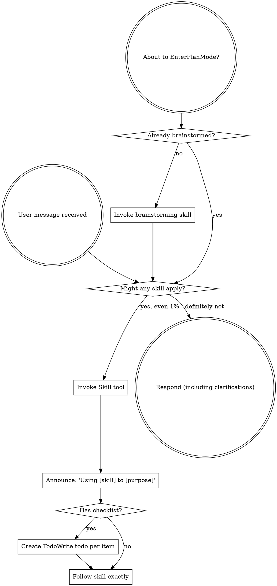

## 双重职责

`using-spec` 承担两个核心职责：

1. **全量安装**：首次安装时，自动将 spec-kit 仓库中所有技能复制到 `.qoder/skills/`，确保项目技能可用
2. **自动调度**：每次对话开始时，根据用户意图自动匹配并调用对应技能，无需用户手动指定

### 自动调度示例

| 用户说 | 自动调用 | 原因 |
|--------|----------|------|
| "帮我设计一个停车调度系统" | `brainstorming` → `document-pm` | 设计新功能 = 创意工作，先头脑风暴再生成PRD |
| "写一个用户登录功能" | `brainstorming` → `writing-plans` → `subagent-driven-development` | 新功能开发 = 完整流程 |
| "这个bug怎么修" | `investigate` → `systematic-debugging` | 调试 = 系统化根因分析 |
| "生成测试用例" | `document-test` | 测试文档 = 领域技能 |
| "提交代码审查" | `requesting-code-review` | 代码审查 = 领域技能 |
| "帮我写个实施计划" | `writing-plans` | 计划编写 = 流程技能 |
| "QA这个网站" | `qa` | 质量保障 = 领域技能 |
| "提交PR" | `requesting-code-review` | 提交PR = 代码审查流程 |

<SUBAGENT-STOP>
If you were dispatched as a subagent to execute a specific task, skip this skill.
</SUBAGENT-STOP>

<EXTREMELY-IMPORTANT>
If you think there is even a 1% chance a skill might apply to what you are doing, you ABSOLUTELY MUST invoke the skill.

IF A SKILL APPLIES TO YOUR TASK, YOU DO NOT HAVE A CHOICE. YOU MUST USE IT.

This is not negotiable. This is not optional. You cannot rationalize your way out of this.
</EXTREMELY-IMPORTANT>

## What This Skill Does

`using-spec` is the Qoder IDE equivalent of `using-superpowers`. It ensures all spec-kit skills are discoverable and enforces the discipline of checking for applicable skills before every action.

When installed via `npx skills add <repo> --skill using-spec -a qoder`, it automatically installs ALL skills from the spec-kit repository into `.qoder/skills/`.

## Instruction Priority

Spec-kit skills override default system prompt behavior, but **user instructions always take precedence**:

1. **User's explicit instructions** (AGENTS.md, direct requests) — highest priority
2. **Spec-kit skills** — override default system behavior where they conflict
3. **Default system prompt** — lowest priority

## How to Access Skills

**In Qoder IDE:** Use the `Skill` tool. When you invoke a skill, its content is loaded and presented to you—follow it directly. Never use the Read tool on skill files.

Skills are auto-discovered from `.qoder/skills/`. Type `/` in chat to see all loaded skills.

# Using Skills

## The Rule

**Invoke relevant or requested skills BEFORE any response or action.** Even a 1% chance a skill might apply means that you should invoke the skill to check. If an invoked skill turns out to be wrong for the situation, you don't need to use it.



## Red Flags

These thoughts mean STOP—you're rationalizing:

| Thought | Reality |
|---------|---------|
| "This is just a simple question" | Questions are tasks. Check for skills. |
| "I need more context first" | Skill check comes BEFORE clarifying questions. |
| "Let me explore the codebase first" | Skills tell you HOW to explore. Check first. |
| "I can check git/files quickly" | Files lack conversation context. Check for skills. |
| "Let me gather information first" | Skills tell you HOW to gather information. |
| "This doesn't need a formal skill" | If a skill exists, use it. |
| "I remember this skill" | Skills evolve. Read current version. |
| "This doesn't count as a task" | Action = task. Check for skills. |
| "The skill is overkill" | Simple things become complex. Use it. |
| "I'll just do this one thing first" | Check BEFORE doing anything. |
| "This feels productive" | Undisciplined action wastes time. Skills prevent this. |
| "I know what that means" | Knowing the concept ≠ using the skill. Invoke it. |

## Skill Priority

When multiple skills could apply, use this order:

1. **Process skills first** (brainstorming, debugging) - these determine HOW to approach the task
2. **Implementation skills second** (frontend-design, document) - these guide execution
3. **Domain skills third** (document-pm, document-dev, qa) - these handle specific workflows

### 技能链路（Skill Chains）

常见的多技能协作链路：

| 场景 | 技能链路 | 说明 |
|------|----------|------|
| 新功能设计 | `brainstorming` → `document-pm` | 先需求探索，再生成PRD |
| 新功能开发 | `brainstorming` → `writing-plans` → `subagent-driven-development` | 需求→计划→执行 |
| Bug修复 | `investigate` → `systematic-debugging` | 根因分析→系统化修复 |
| 设计文档 | `document-dev` | 内置 writing-plans 集成 |
| 测试报告 | `document-test` | 测试用例+报告管理 |
| 代码审查 | `requesting-code-review` | 派发审查子代理 |
| 提交PR | `requesting-code-review` | 派发审查子代理 |

### 意图关键词匹配规则

| 关键词模式 | 匹配技能 |
|------------|----------|
| 设计/创建/开发/实现/构建 新功能/系统/模块 | `brainstorming` |
| 修复/调试/排查/为什么 报错/bug/异常 | `investigate` |
| 写/生成 PRD/需求文档 | `document-pm` |
| 写/生成 设计文档/实施计划 | `document-dev` |
| 写/生成 测试用例/测试报告 | `document-test` |
| 代码审查/review | `requesting-code-review` |
| 提交PR/代码审查/review | `requesting-code-review` |
| 经验总结/复盘 | `document-compound` |

**关键规则**：`brainstorming` 是所有创意工作的前置技能。任何涉及"设计"、"创建"、"开发"的请求，都必须先调用 `brainstorming`。

## Skill Types

**Rigid** (TDD, debugging): Follow exactly. Don't adapt away discipline.

**Flexible** (patterns): Adapt principles to context.

The skill itself tells you which.

## User Instructions

Instructions say WHAT, not HOW. "Add X" or "Fix Y" doesn't mean skip workflows.

## Installation & First-Time Setup

If skills are missing from `.qoder/skills/`, install all spec-kit skills:

```bash
npx skills add <spec-kit-repo-url> --skill using-spec -a qoder
```

Or install all skills at once (without post-install hook):

```bash
npx skills add <spec-kit-repo-url> -a qoder
```

To verify installed skills, run the discover script:

```bash
bash .qoder/skills/using-spec/scripts/discover-skills.sh
```
